# Time Series: EDA, Cleaning, Progressive model selection, Forecasting, Analysis

### Regression task of predicting levels of pollution in the city of Beijing, China

## **Table of contents** 

1. [Introduction](#introduction)
    * [Project's objective](#projects-objective)
    * [The environment used](#the-environment-used)
        * [Limitations](#limitations)
        * [Technologies used](#technologies-used)
2. [Data description](#data-description)
3. [Feature engineering](#feature-engineering)
4. [Data consistency](#data-consistency)
    * [Target imbalance](#target-imbalance)
5. [Data visualization](#data-visualization)
6. [Data preprocessing](#data-preprocessing)
    * [Outliers](#outliers)
    * [Categoric encoding](#categoric-encoding)
    * [Multicollinearity](#multicollinearity)
    * [Dealing with missing values](#handling-nans)
7. [Trends and dependencies](#trends-and-dependencies)
8. [Standardization](#standardization)
9. [Model selection](#model-selection)
    * [Linear model](#linear-model)
        * [Assumption 1: Random Sampling (passed)](#assumption-1-random-sampling-passed)
        * [Assumption 2: No perfect multicollinearity (passed)](#assumption-2-no-perfect-multicollinearity-passed)
        * [Assumption 3: Homoscedasticity (violated, based on Breusch-Pagan test)](#assumption-3-homoscedasticity-violated-based-on-breusch-pagan-test)
    * [Tree models](#tree-models)
10. [Metric choice](#metric-choice)
11. [Initial comparison](#initial-comparison)
    * [Best models and parameters](#best-models-and-parameters)
12. [Feature importance](#feature-importance)
    * [Prediction-based importance (top 10)](#prediction-based-importance-top-10)
    * [Permutation importance](#permutation-importance)
    * [Re-tuning](#re-tuning)
13. [Model analysis](#model-analysis)
    * [SHAP analysis](#shap-analysis)
        * [SHAP summary beeswarm plot](#shap-summary-beeswarm-plot)
        * [SHAP dependence plot](#shap-dependence-plot)
        * [Force Plot (of the worst outlier)](#force-plot-of-the-worst-outlier)
        * [Summary](#summary)
    * [Normal Q-Q Residual Plot](#normal-q-q-residual-plot)
14. [Addressing heavy tails](#addressing-heavy-tails)
    * [Conditional quantile prediction (CatBoost)](#conditional-quantile-prediction-catboost)
    * [Instance weighing (CatBoost)](#instance-weighing-catboost)
15. [Conclusion](#conclusion)
16. [ Project files' description](#project-files-description)
17. [About author](#about-author)
18. [References](#references)

## Introduction
The niche is being researched upon utter love for the environment and due to the fact of similarity with my home country of Ukraine. Not in terms of industrial progress, but rather in the development gap between industrialization and pollution-coping mechanisms.

### Project's objective
The goal of the project is to build the simplest and the most effective regression model (the preference is given to efficiency) for predicting pollution levels, namely `PM2.5`. Also: 
- Explore the model's weaknesses
- Conclude any relevant relationship in the data that might help with the purpose

### The environment used
Home PC is utilized, no significant resources needed.

#### Limitations
We are only limited with the data provided. This is the only thing we rely on, trying to manage the situation as precise as possible.

### Technologies used
All of the instruments used are popular and well-known. I suggest we look at them as a code for convenience:

```python
# ========================== OS, Data, Numerical Libraries ==========================
import os                              # Interacting with the operating system
import pandas as pd                    # Data manipulation and analysis
import numpy as np                     # Numerical computing

# ========================== Visualization Libraries ================================
import matplotlib.pyplot as plt        # Data visualization (static plots)
import seaborn as sns                  # Data visualization (statistical plots)

# ========================== Statistical Tools ======================================
from scipy import stats                # QQ probability plots, statistical tests
import statsmodels.api as sm           # Statistical models, including residual analysis
from statsmodels.stats.diagnostic import het_breuschpagan  # Heteroscedasticity test
from statsmodels.stats.outliers_influence import variance_inflation_factor  # VIF calculation
from statsmodels.tools.tools import add_constant         # Adds intercept term to models

# ========================== Preprocessing ==========================================
from sklearn.preprocessing import OneHotEncoder        # Encoding categorical variables
from sklearn.preprocessing import StandardScaler       # Feature scaling
from sklearn.impute import SimpleImputer               # Handling missing values (simple)
from sklearn.experimental import enable_iterative_imputer  # Enable advanced imputation
from sklearn.impute import IterativeImputer            # Multivariate imputation

# ========================== Model Selection & Validation ============================
from sklearn.model_selection import train_test_split   # Splitting data into train/test
from sklearn.model_selection import cross_validate     # Cross-validation procedure

# ========================== Regression Models =======================================
from sklearn.ensemble import RandomForestRegressor      # Tree-based ensemble model
from sklearn.ensemble import ExtraTreesRegressor        # More randomized ensemble
from sklearn.ensemble import VotingRegressor            # Model ensembling (averaging)
import lightgbm as lgb                                  # Gradient boosting framework
import xgboost as xgb                                   # Gradient boosting framework
from catboost import CatBoostRegressor, Pool            # Gradient boosting (handles categoricals)

# ========================== Model Evaluation ========================================
from sklearn.metrics import mean_absolute_error, mean_squared_error, r2_score  # Standard metrics
from sklearn.metrics import make_scorer                                         # Custom metric integration
from sklearn.inspection import permutation_importance                           # Model-agnostic feature importance

# ========================== Explainability =========================================
import shap                                                # SHAP values for model interpretability

# ========================== Utilities ===============================================
import time                                                # Timing operations
import joblib                                              # Saving/loading models
```

## Data description
The data is a set of air quality estimators represented hourly for a station of Aotizhongxin, Beijing. They are represented via a `.csv` file. The set has only one object feature (`wd`). Its columns are:
- `NO` (index) - number of row
- `year` - year the record was made
- `month` - month the record was made
- `day` - day the record was made
- `hour` - hour the record was made (dropped after creating `sin_hour` and `cos_hour` that represents it, but removes linearity - since 0-24 repeat throughout)
- `PM2.5` (target) - fine particles, easy to inhale, with a diameter of 2.5 micrometers or less; penetrate deep into the lungs and even enter the bloodstream, posing significant health risks (ug/m^3)
- `PM10` - particulate matter with a diameter of 10 micrometers or less (ug/m^3)
- `SO2` - SO2 concentration (ug/m^3)
- `NO2` - NO2 concentration (ug/m^3)
- `CO` - CO concentration (ug/m^3)
- `O3` - O3 concentration (ug/m^3)
- `TEMP` - temperature (degree Celsius) 
- `PRES` - pressure (hPa)
- `DEWP` - dew point temperature (degree Celsius)
- `RAIN` - precipitation (mm)
- `wd` - wind direction
- `WSPM`: wind speed (m/s)
- `station` - name of the air-quality monitoring site


## Feature engineering:
The engineering was performed with a regular inspection of variance inflation factor. All multicollinearity issues were also resolved here.

- `is_weekend` - if a day is a weekend
- `sin_hour` - a cyclical encoding of the `hour` feature to preserve its circular nature before dropping
- `cos_hour` - a cyclical encoding of the `hour` feature to preserve its circular nature before dropping
- `month_sin` - a cyclical encoding of the `month` feature to preserve its circular nature before dropping
- `dayofweek` - Monday=0, Sunday=6 etc.
- `dayofweek_sin` - a cyclical encoding of the `dayofweek` feature to preserve its circular nature before dropping
- `dayofweek_cos` - a cyclical encoding of the `dayofweek` feature to preserve its circular nature before dropping
- `TEMP_x_CO` - an unobvious dependency of temperature and CO [[7]](#references)
- `NO2_x_RAIN` - an unobvious dependency of rain and NO2 [[8]](#references)
- `WSPM_X_SO2` - a dependency of wind speed and the dispersion of sulfur dioxide 
- `PM10_diff1` - captures recent changes in PM10 levels, introducing short-term trends for `PM10`
- `TEMP_diff1` - captures recent changes in PM10 levels, introducing short-term trends for `TEMP`

## Data consistency
- No inconsistencies in datetime.
- No duplicate rows.

### Target imbalance
The target is imbalanced as most values cluster around smaller numbers. It is already expected that the model is unlikely to be precise enough with larger values. 

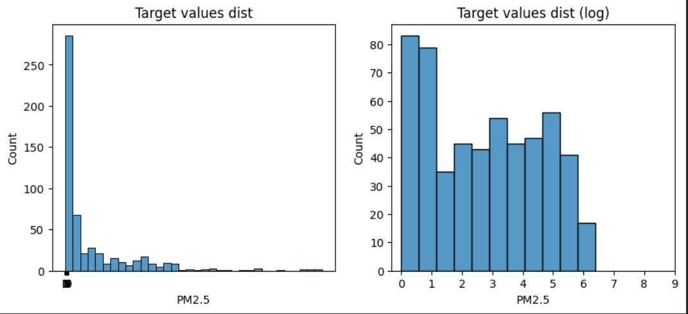

Since it's time series analysis we may not break time relation, therefore any stratified sampling strategies (including under- and oversampling) are invalid. The expected improving factor to pay attention to more: feature analysis. 

## Data visualization
Before proceeding to working with the dataset, we should look at it and obtain basic information on skewness and distributions. These will help us with imputing NaNs.
- `PM2.5` (target) - approx. normal dist. with a slight left skew. Mean is suitable for imputing.
- `PM10` - approx. normal; right skewed, heavier tail. Median is suitable for imputing.
- `SO2` - exponential with a skew. Better to use: knn / iterative imputer. Fallback: median.
- `NO2` - approx. normal; left-skewed. Median.
- `CO` - approx. normal; insignificant skew. Median.
- `O3` - bimodal. Better to use: knn / iterative imputer. Fallback: median.
- `TEMP` - bimodal with a severe left skew. Better to use: knn / iterative imputer. Fallback: median.
- `PRES` - approx. normal. Mean is suitable.
- `DEWP` - bimodal with a severe left skew. Better to use: knn / iterative imputer. Fallback: median.
- `RAIN` - exponential. Better to use: knn / iterative imputer. Fallback: median.
- `WSPM` - approx. normal, but has a hint of bimodality. Better to use: knn / iterative imputer. Fallback: median.

## Data preprocessing

### Outliers
Outliers were handled based on [data visualization analysis](#data-visualization) visually. The severity of handling is determined as low (6 / 35 064 rows).

### Categoric encoding
Handled. There was only one categoric feature - `wd`. The nature is nominal, so `OneHotEncode` was utilized.

### Multicollinearity
Based on Variance Inflation Factor (VIF) analysis, strong multicollinearity occurred within `DEWP` and `PRES`, the features were dropped.

### Handling `NaN`s
The highest extent of missing values per feature: 5%. Missing values were handled based on [data visualization analysis](#data-visualization).

The categoric feature was imputed using random imputation based on existing distribution as it had no strong correlation for predictor-based imputations.

## Trends and dependencies
Based on the plots below, the pollution is at its peak at night, most likely when there are the fewest people outside. 

It is also the most active on Saturday when people are at home, presumably. 

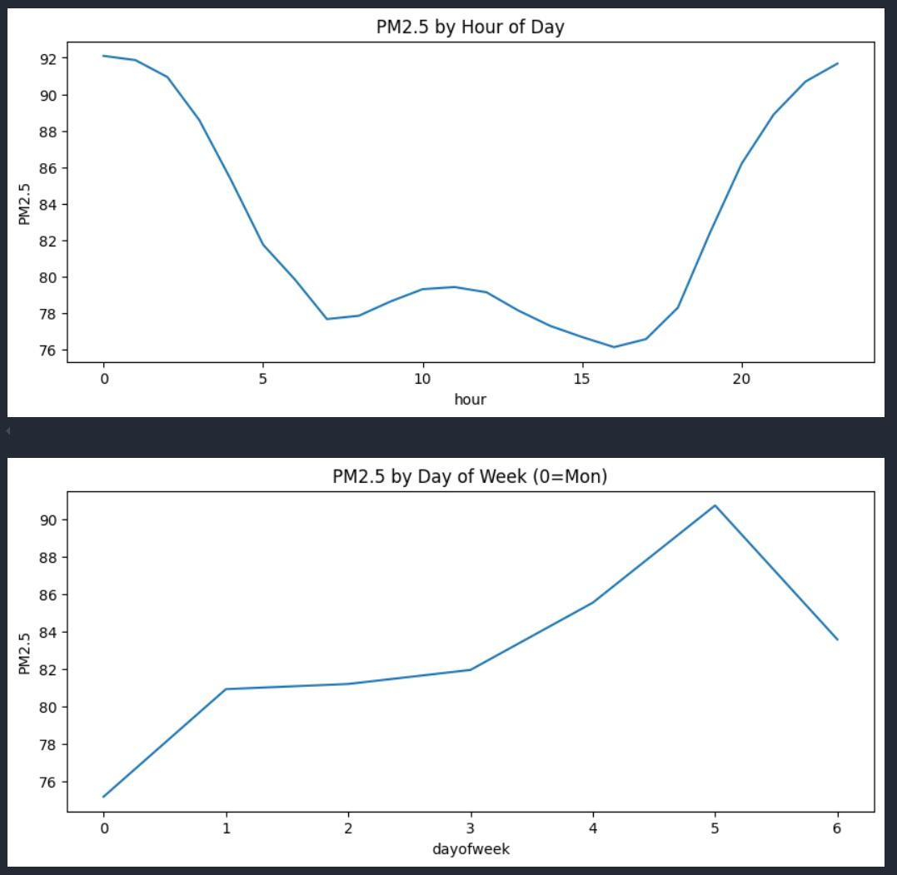

The coldest months are showing the highest rates of pollution as well, possibly because it's easier to cool down the facilities and it is not exacerbated by the sun heat. 


The year plot doesn't give a clear understanding, but apparently the tendency of increase pollution is taking its toll.

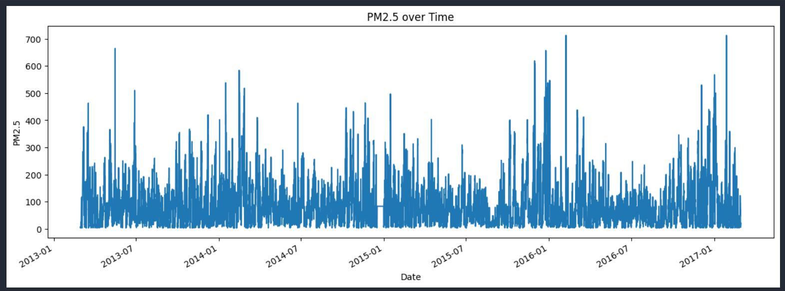

## Standardization
No strict need, purely following best-practice guidelines to stabilize the coefficients in the learning process and forestall any limitations.

## Model selection
First, Linear dependencies are checked by validating Gauss-Markov assumptions.

### Linear model

#### Assumption 1: Random Sampling (passed)
The sampling is balanced, time series has no gaps and time marks are ordered correctly.

#### Assumption 2: No perfect multicollinearity (passed)
It was successfully handled in [feature engineering](#feature-engineering).

#### Assumption 3: Homoscedasticity (violated, based on Breusch-Pagan test)
The model is heteroscedastic (expected based on the [target imbalance](#target-imbalance)). The hypothesis is now confirmed with `p-value` -> `0` and a large Lagrange multiplier of `10 004`. 

Before rejecting Linear models, the nature of homoscedasticity needs to be checked. If it's structural, the linear hypothesis is rejected. Otherwise, if can fix it, it's flexible and we may go on with the rest of the assumptions.

The target only contains positive values, hence the perfect transformation is expected to reduce variance and (possibly) resolve heteroscedasticity (`log`). Outlier removal is also an option, but it has already been done.

After transformation, Lagrange multiplier became smaller (`1392`), but `p-values` are still approaching `0` (`4.869912132913048e-270`).

There is no point in checking the remaining assumptions. Heteroscedasticity is structural. Linear models will not be considered.

### Tree models
- Run different model types (`Random Forest`, `Extra Trees`, `LightGBM`, `XGBoost`, `CatBoost`) with similar, rough parameters
- Pick the best-performing algorithm
- feature reduction for model optimization
- Fine-tune only the selected model(s)

Selected "rough parameters" for each (3 runs per model):
- max_depth = 10
- num_leaves = 10
- learning_rate = 0.1
- n_estimators = 100, 200, 300

## Metric choice
- `MAE` (to understand general error)
- `RMSE` (for outlier / big mistakes sensitivity) - this is the one to minimize since we have an [imbalanced target](#target-imbalance) that needs to be addressed in larger values
- `R2` (for assessing how well the model understands the data)
- Training time (although it's preliminary consumed during training, it also make the model denser and takes its toll in the inference. Additionally, we might want to maintain the relevance by training it on new data as well which would also require the resources).

In the process of the progressive model selection, the following factors are going to be used as well:
- Sanity Check (if a model makes sense)
- Reference Point (if a complex model doesn’t outperform a simple baseline, it’s pointless)
- Speed-value trade-off (if we get very little value by paying with computational power and time, it is pointless)


## Initial comparison

| Model |   Random Forest | Extra Trees | LightGBM  | XGBoost | CatBoost |
|-------| ----------------| ------------|------------|-------|-----------|
| min MAE | 14.585        | 16.033      |13.674     |12.264 |12.226     |
| min RMSE |23.226        |24.702       |22.625     |20.569 |20.957     |
| max R2 |0.902           |0.892        |0.912      |0.923  |0.926      |

`XGBoostRegressor` and `CatBoostRegressor` clearly outperform others with the latter being superior. Considering an approximate closeness of `XGBoost`'s and `CatBoost`'s performances, it might be a good idea to tune them both and then make an ensemble.

### Best models and parameters

| Best model | n_estimators | learning_rate | max_depth | MAE | RMSE| R2|
|-------| ----------------| ------------|------------|-------|-----------|---|
| XGBoost | 4900        | 0.05      |-     |11.078 |19.386     | 0.931 |
| CatBoost |1500        |0.22       |12     |11.003 |19.453     | 0.936 |

## Feature importance
In order to understand the way the model behaves, we are performing feature importance analysis that comprises of:
- model importance → what model thinks (prediction based; computes how much the model’s output (prediction) changes on average when that feature is used). It is how this particular model uses each feature
- permutation importance → what can I drop if dimensionality reduction is considered (measures how much shuffling each feature hurts performance)
- SHAP plots
    - SHAP summary bar plot (ranks features by global importance across the entire dataset)
    - SHAP summary beeswarm plot (shows which features pushed the prediction up and down)
    - Shows how the SHAP value of `feature1` changes depending on the size of that feature + plots the strongest dependence on the automatically determined `feature2`
    - SHAP force plot; debugging (for one specific prediction, it shows which features pushed the prediction higher or lower)

### Prediction-based importance (top 10)
`PM10` = 28.37 means that when the model uses it in its trees, it changes the prediction by ~28 on average.

|   |   |
|---|---|
|PM10          |   28.371562|
|CO             |  12.164665|
|year           |   6.398174|
|TEMP_x_CO      |   5.788443|
|month_sin      |   5.693101|
|PM10_diff1     |   4.729217|
|NO2            |   4.534136|
|TEMP           |   4.301287|
|dayofweek_sin  |   4.096504|
|O3              |  3.829348|

Analysis is done with `PM10` being the most valuable feature. 

### Permutation importance
[The best two models](#best-models-and-parameters) appear to consider the same set of parameters redundant (determined by setting an importance threshold of `0.001`): `RAIN`, `wd_ENE`, `wd_ESE`, `wd_N`, `wd_NE`, `wd_NNE`, `wd_NNW`, `wd_NW`, `wd_S`, `wd_SE`, `wd_SSE`, `wd_SSW`, `wd_SW`, `wd_W`, `wd_WNW`, `wd_WSW`, `is_weekend`, `NO2_x_RAIN`.

|   |   |
|---|---|
|PM10        |  0.781955|
|CO          |  0.179571|
|TEMP_x_CO   |  0.039114|
|NO2         |  0.031548|
|year        |  0.024381|
|O3          |  0.023831|
|month_sin   |  0.020573|
|TEMP        |  0.018511|
|PM10_diff1  |  0.013580|
|SO2         |  0.009617|

Permutation importance highlights the importance of `PM10` as well. The least impactful features such as `sin_hour`, `cos_hour` etc. may be considered for elimination if dimensionality reduction is important.

### Re-tuning
The models ver.1 (original) will be now modified (the redundant features dropped) into ver.2, re-tuned and ensembled, the difference is presented in the table:

| Best model | n_estimators | learning_rate | max_depth | MAE | RMSE| R2|
|-------| ----------------| ------------|------------|-------|-----------|---|
| XGBoost (ver. 1) | 4900        | 0.05      |-     |11.078 |19.386     | 0.931 |
| XGBoost (ver. 2) | 4900        | 0.08      |-     |11.095 |19.535     | 0.931 |
| CatBoost (ver. 1) |1500        |0.22       |12     |11.003 |19.453     | 0.936 |
| CatBoost (ver. 2) |1500        |0.16       |13     |10.863 |19.453     | 0.934 |
| Ensemble |-        |-       |-     |10.939 |19.029     | 0.933 |

The ensemble has the lowest `RMSE` and averaged predictions in terms of `MAE`. The `CatBoost` regressor has advanced, but the `XGBoost` remained superior in its ver. 1. The ensemble is chosen as the primary model for now.

Based on the new (ensemble) permutation importance and prediction-based feature importance, the priorities align and the top features are `PM10` and `CO`, other values tend to vary. The way the ensemble performs and prioritizes is closely related to the way the features actually impact it. It is more likely consistent and reliable.

## Model analysis

### SHAP analysis
Due to the best model's being an ensemble, we cannot calculate SHAP on it, but since the models are similar in their nature and feature prioritizing, we may average SHAPs of each of them:

```python
explainer_cat = shap.TreeExplainer(best_cat_model) 
shap_values_cat = explainer_cat.shap_values(X_test)

explainer_xgboost = shap.TreeExplainer(best_xgboost_model)
shap_values_xgboost = explainer_xgboost.shap_values(X_test)

shap_values_ensemble = (shap_values_cat + shap_values_xgboost) / 2
explainer_ensemble = (explainer_cat.expected_value + explainer_xgboost.expected_value) / 2
```

The following [SHAP plots](#feature-importance) suggest:

Top Features are : `PM10`, `CO`, `TEMPxCO`, `NO2`, `O3`.

`PM10` has the largest average impact indeed. `CO` and `TEMP` follow but with much smaller impact. I assume that particles of 10 micrometers is way simpler to spot. If they are already in the air, it is only a matter of quantity of how much of the smaller ones (2.5 mcm) are there [[3]](#references).

`CO` must also be dominant as it is an air pollutant as well and helps understand the severance of the pollution at the given moment [[4]](#references).

`NO2` is a gaseous pollutant primarily from the burning of fuels, especially in vehicles and industrial processes, it explains how its quantity has a say in the model [[5]](#references).

`O3` can vary depending on the location, season, and specific atmospheric conditions, therefore the relation is weaker
 [[6]](#references).

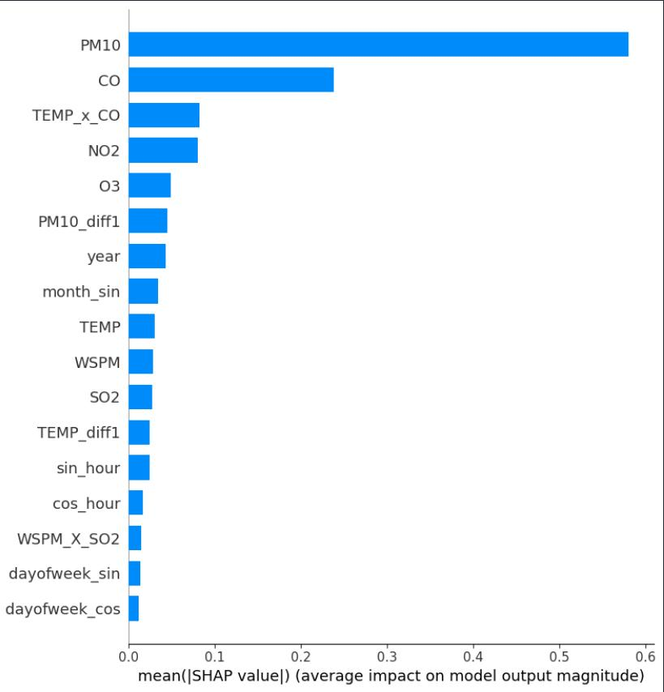

No contradictory dependencies were found and the research suggests the impact of each is sane.

#### SHAP summary beeswarm plot
- The higher the `PM10`, the more it is positively correlated with predicted `PM2.5`.
- As mentioned above, `CO`, as one of the compounds of `PM2.5`, strongly reflects the air quality: the lower the `CO`, the lower the `PM10` and the lower the `PM10`, the lower the `PM2.5`.
- `WSPM` seems to have a reversed effect: windy days predict lower PM2.5, possibly because it's more dangerous for the people and more substances can reach densely populated areas with a strong wind.

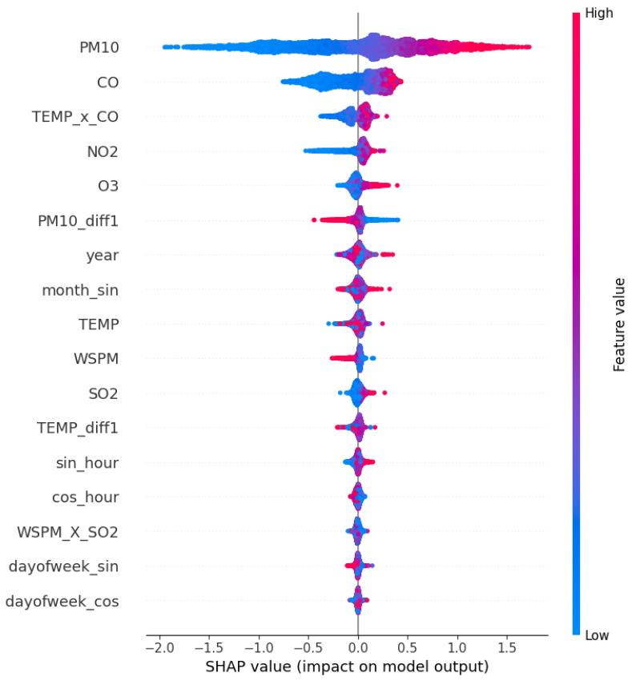

#### SHAP dependence plot
The automatically selected feature's being `CO` confirms the mentioned above presumption of its tight relation with the target. `CO` increases as `PM2.5` concentrates.

Clear upward trend: as `PM10` increases, its impact on prediction increases. Its effect is strong and predictable, no clear instability.

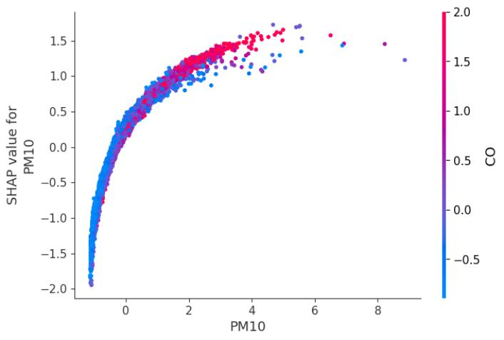

#### Force Plot (of the worst outlier)
Predicted value significantly different from true value. The model expected high `PM2.5` mainly because of high `PM10` and `CO`. The error is likely because of high `PM10_diff1`. The feature reduces variance and gets us a better score, but trade-offs like this exist.

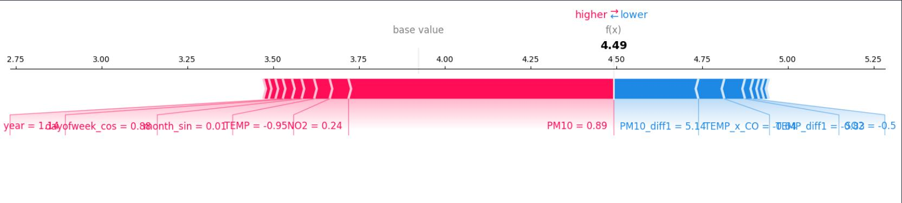

Input features for the outlier:
| | |
|---|----|
|year           |    3.114442|
|PM10          |     2.425254|
|SO2           |     0.603729|
|NO2           |     1.274631|
|CO            |     0.801782|
|O3            |     0.498756|
|TEMP          |     0.388130|
|WSPM         |      0.603158|
|sin_hour      |     0.255109|
|cos_hour      |     0.693491|
|month_sin     |     1.007012|
|dayofweek_sin  |    3.025526|
|dayofweek_cos |     2.412046|
|TEMP_x_CO    |      0.528921|
|WSPM_X_SO2   |      0.594730|
|PM10_diff1    |   171.374734|
|TEMP_diff1    |     0.434259|

```
Predicted value (original scale): 91.4052050357972
Ground truth (original scale): 3.0000000000000004
Prediction error (original scale): 88.4052050357972
```

#### Summary
The model’s understanding is physically reasonable: higher pollutants → higher `PM2.5`. No critical model flaws detected.

### Residual plot
Residuals scatter around zero but increase in spread for very high predicted values. This exhibits “heteroscedasticity”, as was established before. The middle range is acceptable.

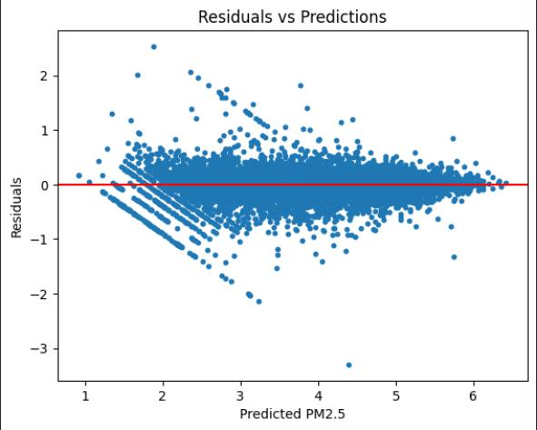

### Normal Q-Q Residual Plot
Residuals follow the diagonal in the middle but deviate significantly in both tails. Model struggles more at extreme and low predicted values. Some systematic error is present at the tails.

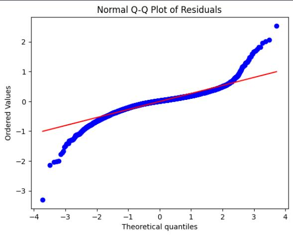

## Addressing heavy tails
We try 2 strategies: `prediction of different quantiles` instead of mean (usual regression), it is less sensitive to outliers, may help to reduce variance more, and `instance weighing` to give more importance to higher values during training.

### Conditional quantile prediction (CatBoost)
Here we tune the model with different quantile values focusing on `MAE` as it is what quantile regression minimizes.

|quantile|	MAE|	RMSE|	R2|
|-------|------|--------|-----|
|0.50|	11.963598|	21.457060|	0.923816|
|0.55|	11.739502|	20.811898|	0.921526|
|0.60|	11.901170|	20.865105|	0.921046|
|0.65|	11.885616|	21.160224|	0.922104|
|0.70|	11.963459|	21.015434|	0.917964|
|0.75|	12.055981|	21.328876|	0.917341|

The best is `0.55`. Its metrics aren't superior to already existent models.

### Instance weighing (CatBoost)
To Give higher weight to larger values since the data for large values is scarcer.

The process of tuning is in 2 stages - trying different quantiles (after which quantile to prioritize weights), then weights (how strong to prioritize):

|quantile|	MAE|	RMSE|	R2|
|-------|------|--------|-----|
|0.70	|10.337702	|18.190367	|0.936105|
|0.75	|10.384607	|18.433868	|0.935700|
|0.80	|10.447152	|18.694060	|0.935418|
|0.85	|10.343698	|18.278911	|0.937236|
|0.90	|10.513136	|18.632863	|0.936206|
|0.95	|10.723944	|18.956449	|0.934773|

The best choice is `0.7`. Tuning the weight:

|weight (given quant = 0.7)|	MAE|	RMSE|	R2|
|-------|------|--------|-----|
|1.5	|10.649971	|19.004143	|0.936000|
|2.0	|10.582168	|18.953337	|0.934838|
|2.5	|10.495934	|18.680665	|0.935292|
|3.0	|10.337702	|18.190367	|0.936105|
|3.5	|10.371511	|18.288637	|0.936315|
|4.0	|10.320960	|18.267060	|0.935636|
|4.5	|10.204659	|17.927377	|0.936372|
|5.0	|10.289145	|18.387680	|0.936887|

The best weight is `4.5`. The metrics are better than the best ensemble so far. The residual and the qq plot doesn't reflect much difference, but has fewer outliers in some areas, and the tails have become smoother.

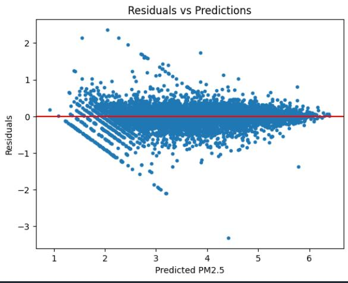
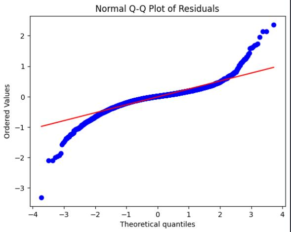

The attempt to tune XGBoost the same way was made with no luck.

## Conclusion
The task aimed to predict `PM2.5` concentrations using the simplest, most effective model with a strong focus on practical efficiency. Linear models were discarded due to structural heteroscedasticity that could not be resolved by transformation. Tree-based models proved to be more robust and better suited to the problem.

Several ensemble models were trained and compared, with `XGBoost` and `CatBoost` showing the strongest performance. Feature reduction through permutation importance showed that many features, especially those related to wind direction, had little impact on the model and could be safely removed without performance loss.

Further fine-tuning and ensembling improved results, but most gains were marginal. Ultimately, `CatBoost` with instance weighting produced the best-performing model, reducing the `RMSE` to `17.93` and achieving the best MAE of `10.20`. Attempts to improve `XGBoost` with the same methods failed to outperform `CatBoost`.

The most important features were consistently `PM10` and `CO`, followed by temperature-related interactions. The model’s learned relationships were physically reasonable: more pollutants lead to higher `PM2.5`, and higher wind speed tends to reduce it.

SHAP analysis confirmed that the model decisions aligned with real-world expectations, and the force plot for the largest outlier highlighted where the model can still be misled.

Residual analysis showed the model still struggles in the tails, especially at high predicted values, though variance reduction was achieved compared to earlier attempts.

The project demonstrates that increasing model complexity beyond tree ensembles is not justified in this case. Even advanced techniques such as quantile regression did not significantly outperform simpler weighted regression. The most meaningful improvements came from careful feature selection, tuning, and practical handling of imbalance.

The challenges faced included:
- structural variance
- target imbalance
- feature redundancy

These were systematically addressed using statistical tests, feature importance analysis, and iterative model refinement.

The residual distribution, while improved, does not fully satisfy the assumption of homoscedasticity. The remaining "striped" patterns suggest that the model systematically over- or under-predicts for specific data segments, which a tree-based model inherently struggles to resolve due to its stepwise approximation nature.

The final model follows `CatBoostRegression` algorithm and the best scores and parameters exhibit:

|Best model | n_estimators | max_depth | learning_rate | sample_weight | MAE | RMSE | R2 |
|-----|-----|-----|-----|-----|-----|-----|-----|
| CatBoost | 1500 | 13 | 0.16 | > quantile(0.7), x4.5 | 10.205 | 17.927 | 0.936 |

This work demonstrates that, for this problem, additional model complexity is not warranted. Instead, data enrichment or further exploration of the underlying data generation process is likely more beneficial than pursuing algorithmic sophistication.

## Project files' description
- README.md - complete description of the solution
- img - directory with images for the README.md
- data - directory with the original and processed data
- requirements.txt - required python modules
- EDA_research.ipynb - exploratory data analysis of the dataset, data preprocessing and cleaning, visualizing, trend analysis.
- modelling1Linear.ipynb - testing linear assumptions, transforming target to address heteroscedasticity
- modelling2Trees.ipynb - training, fine-tuning tree models, debugging and reducing variance, up to the best model
- shap_values_cat.npy - SHAP values for the CatBoost model (before weighing)
- shap_values_xgboost.npy - SHAP values for the XGBoost model (before weighing)
- perform_EDA.py - performs full EDA and cleaning of the data, including feature engineering, gets the data fully ready for training
- training_and_inference.py - code for the best model training and testing; saves the model

## About author
Project by Yurii Dzbanovskyi
* Email: [uradzb@ukr.net](mailto:uradzb@ukr.net)
* Telegram: [+38 096 874 17 18](https://t.me/@uradzb)

## References
1. [Data source](https://archive.ics.uci.edu/dataset/501/beijing+pm2+5+data)
2. [Interpreting Residual Plots to Improve Your Regression](https://www.qualtrics.com/support/stats-iq/analyses/regression-guides/interpreting-residual-plots-improve-regression/)
3. [Inhalable Particulate Matter and Health (PM2.5 and PM10)
](https://ww2.arb.ca.gov/resources/inhalable-particulate-matter-and-health#:~:text=Those%20with%20a%20diameter%20of,comprises%20a%20portion%20of%20PM10.)
4. [Carbon monoxide (CO) or PM2.5](https://www.aqi.in/blog/carbon-monoxide-co-or-pm2-5/#:~:text=Conclusion,the%20health%20of%20our%20communities)
5. [The association between ambient NO2 and PM2.5 with the respiratory health of school children residing in informal settlements](https://www.sciencedirect.com/science/article/abs/pii/S0013935120304990#:~:text=The%20strongest%20and%20most%20consistent,Funding)
6. [Correlation between surface PM2.5 and O3 in eastern China during 2015–2019: Spatiotemporal variations and meteorological impacts](https://www.sciencedirect.com/science/article/abs/pii/S1352231022005854#:~:text=The%20relationship%20between%20PM2.5,et%20al.%2C%202022))
7. [Temperature Effects on the Surface CO Population during CO2 Electroreduction](https://pubs.acs.org/doi/10.1021/acscatal.5c01173#:~:text=In%20industrial%20implementations%2C%20CO2,transport%2C%20and%20elementary%20reaction%20rates.)
8. [New indices for wet scavenging of air pollutants (O3, CO, NO2, SO2, and PM10) by summertime rain](https://www.sciencedirect.com/science/article/pii/S1352231013007759#:~:text=Three%20new%20washout%20indices%20for,this%20are%20discussed%20as%20well.)