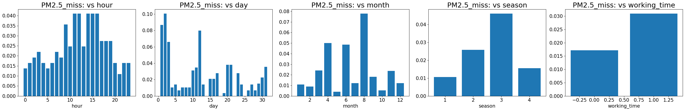
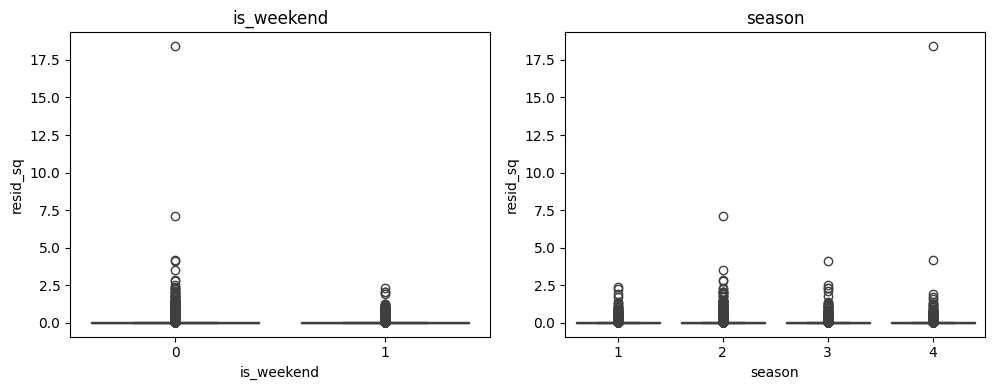

# Time Series: EDA, Cleaning, Progressive model selection, Forecasting, Analysis

### Regression task of predicting levels of pollution in the city of Beijing, China
#### Goals: 
- To explore, visualize, understand, pre-process, encode, split and save the data. Data must contain comprehensible, readable, intuitive information (feature names, data types, encodings) and reflect the reality (be interpretable and feature- and time-consistent)
- To explore the missingness, visualize and explain its nature by building the respective model. The problem must be researched from both feature- and time-dependent perspectives where the latter is prioritized
- To select and fine-tune a model for null imputation that would reflect the missingness nature and produce numerically and visually meaningful predictions
- Build and tune a time-series regression model for `PM2.5` prediction. If the model isn't capable of interpretation, build another side model for inference

## **Table of contents** 

1. [Introduction](#1-introduction)
    * [Project's objective](#projects-objective)
    * [The environment used](#the-environment-used)
        * [Limitations](#limitations)
        * [Technologies used](#technologies-used)
            * [Libraries](#libraries)
            * [Custom functions](#custom-functions)
2. [EDA, Data-cleaning, pre-processing, visualization](#1-eda-data-cleaning-pre-processing-visualization)
    * [Data description](#data-description)
    * [Renaming / Removing extra columns](#renaming--removing-extra-columns)
    * [Missing values overview](#missing-values-overview)
    * [Train-test split](#train-test-split)
    * [Data consistency](#data-consistency)
        * [Target consistency](#target-consistency)
            * [Is target's imbalance a reflection of a reality or underrepresented data?](#is-targets-imbalance-a-reflection-of-a-reality-or-underrepresented-data)
            * [Are target values always underrepresented in the middle of the day?](#are-target-values-always-underrepresented-in-the-middle-of-the-day)
            * [Addressing the imbalance](#addressing-the-imbalance)
    * [Visualizing numeric columns, checking for outliers](#visualizing-numeric-columns-checking-for-outliers)
    * [Capping extreme outliers](#capping-extreme-outliers)
        * [Winsorization](#winsorization)
    * [Data encoding](#data-encoding)
        * [Ordinal encoding](#ordinal-encoding)
            * [Binning](#binning)
        * [Nominal encoding](#nominal-encoding)
        * [Cyclical encoding](#cyclical-encoding)
3. [Missing values: typology and explanation](#3-missing-values-typology-and-explanation)
    * [Missing values typology](#missing-values-typology)
        * [Summary](#summary-missing-values-typology)
    * [Can we explain the missingness by something we observe?](#can-we-explain-the-missingness-by-something-we-observe)
    * [Missingness classification model](#missingness-classification-model)
        * [Assumption validation](#assumption-validation)
            * [Assumption 1: Sufficient overlap and data](#sufficient-overlap-and-data)
            * [Assumption 2: Perfect / high multicollinearity (classification)](#perfect--high-multicollinearity-classification)
                * [Residualization](#residualization)
    * [Model selection (classification)](#model-selection-classification)
        * [Assumption 3: Independent residuals (no autocorrelation in residuals)](#independent-residuals-no-autocorrelation-in-residuals)
            * [Stationarity check](#stationarity-check)
            * [ACF/PACF analysis](#acfpacf-analysis)
        * [Assumption 4: Homoscedasticity](#homoscedasticity)
        * [Assumption 5: Stable coefficients](#bootstrap-coefficient-stability)
    * [Interpretation: coefficient extraction + visualization](#interpretation-coefficient-extraction--visualization)
        * [Coefficient extraction (original scales)](#coefficient-extraction-original-scales)
        * [Summary](#summary-interpretation-classification)
4. [Missing values imputation](#4-missing-values-imputation)
    * [Chosen metrics](#chosen-metrics)
    * [Assumption 1: Perfect / high multicollinearity](#perfect--high-multicollinearity-missing-values-imputation)
    * [Imputation strategy & progressive model selection](#imputation-strategy--progressive-model-selection)
        * [Choosing the best module](#choosing-the-best-model)
        * [Tuning](#tuning)
    * [Categorical null imputation](#categorical-null-imputation)
        * [Visualizing the imputations](#visualizing-the-imputations)
    * [Summary](#summary-missingness-imputation)
5. [`PM2.5`: prediction and interpretability](#5pm25-prediction-and-interpretability)
    * [Model selection overview](#model-selection-overview)
        * [Nature of the task](#nature-of-the-task)
        * [Model selection](#model-selection-regression)
    * [Assumption check](#assumption-check)
        * [Overview](#overview)
        * [Assumption 1: Data consistency](#data-consistency-regression)
        * [Assumption 2: Sufficient overlap and data](#sufficient-overlap-and-data-regression)
        * [Assumption 3: Collinearity](#collinearity)
    * [Baseline fit + tree model selection](#baseline-fit--tree-model-selection)
        * [Baseline fit and tuning](#baseline-fit-and-tuning)
        * [Tree model and metric-selection](#tree-model-and-metric-selection)
        * [Assumption 4: Independent residuals (no autocorrelation)](#independent-residuals-no-autocorrelation)
            * [Autocorrelation in SARIMAX](#autocorrelation-in-sarimax)
            * [Autocorrelation in LGBM](#autocorrelation-in-lgbm)
        * [Assumption 5: Homoscedasticity in residuals](#homoscedasticity-in-residuals)
            * [Summary](#summary-sarimax--lgbm)
            * [Explaining heteroscedastic nature](#explaining-heteroscedastic-nature)
                * [Predictor-related heteroscedasticity](#predictor-related-heteroscedasticity)
                * [Time-related heteroscedasticity](#time-related-heteroscedasticity)
                * [Summary](#summary-heteroscedasticity)
    * [Interpretation](#interpretation)
        * [Strong and reliable predictors](#strong-and-reliable-predictors)
        * [Moderate predictors](#moderate-predictors)
        * [Weak predictors](#weak-predictors)
        * [Unreliable predictors](#unreliable-predictors)
        * [ARIMA structure terms](#arima-structure-terms)
        * [Conclusion](#conclusion-interpretation)
    * [Fine-Tuning (`PM2.5` regression)](#fine-tuning-pm25-regression)
        * [Plan](#plan)
        * [Tuning (`PM2.5` regression)](#tuning-pm25-regression)
        * [Is tuning complete?](#is-tuning-complete)
        * [Regularization concerns](#regularization-concerns)
        * [Understanding complexity](#understanding-complexity)
        * [Best model fit and test assessment](#best-model-fit-and-test-assessment)
        * [Permutation importance to assess features](#permutation-importance-to-assess-features)
6. [Conclusion](#6-conclusion-final)
7. [Project files' description](#7-project-files-description)
8. [About author](#8-about-author)
9. [References](#9-references)

## 1. Introduction
Lyrical digression: The niche of environmental care is being researched upon utter love for the environment and due to the fact that my home country of Ukraine shares the same problems. Not in terms of industrial progress, but rather in the development gap between industrialization and pollution-coping mechanisms (or their absence).

### Project's objective
The goal of the project is to build the simplest and the most efficient possible regression model for predicting the pollution level of `PM2.5`. The purpose implies that it might be hard for the sensors to recognize particles that small (`2.5` micrometers or less). The model is going to help with prediction of their density based on other accompanying compounds of bigger size and weather conditions, as well as seasonal trends.

### The environment used
Home PC is utilized, no significant resources needed. The consecutive number of rows is `35,064`.

#### Limitations
We are only limited with the data provided. This is the only unit we rely on, trying to manage the situation as precise as possible.

### Technologies used
All of the libraries used are popular and well-known. Their functionality is supplemented with custom functions that act as an automatic pipeline means.

#### Libraries

```python
# ========================== OS, Utilities, and System ==============================
import os                              # Interacting with the operating system
import time                            # Time-related functions
import gc                              # Garbage collection (freeing unused memory)
import warnings                        # Warning control
from typing import Literal             # Type hints for stricter typing

# ========================== Data Handling and Numerical Libraries ==================
import pandas as pd                    # Data manipulation and analysis
import numpy as np                     # Numerical computing
from numpy.linalg import matrix_rank   # Matrix rank (linear algebra)
import math                            # Basic math functions
from math import prod                  # Product of iterable values

# ========================== Visualization and Diagnostics ==========================
from statsmodels.graphics.tsaplots import plot_acf, plot_pacf  # ACF/PACF plots

# ========================== Statistics ============================
import statsmodels.api as sm                            # Statistical modelling
from statsmodels.api import add_constant                # Add intercept to models
from statsmodels.stats.diagnostic import acorr_ljungbox, het_breuschpagan, het_arch  # Diagnostic tests
from statsmodels.stats.stattools import durbin_watson   # Autocorrelation test
from statsmodels.tsa.stattools import acf, adfuller     # Time series tests
from statsmodels.genmod.cov_struct import Independence  # Covariance structures
from statsmodels.stats.outliers_influence import variance_inflation_factor  # Multicollinearity

from scipy import stats                                 # General statistical functions
from pyampute.exploration.mcar_statistical_tests import MCARTest  # Missingness test

# ========================== Machine Learning – Core (Scikit-learn) =================
from sklearn.base import BaseEstimator, TransformerMixin, clone  # Custom transformers
from sklearn.preprocessing import StandardScaler                 # Feature scaling
from sklearn.model_selection import train_test_split, ParameterGrid, cross_validate, TimeSeriesSplit  # Data splitting + CV
from sklearn.impute import SimpleImputer, IterativeImputer        # Missing data imputation
from sklearn.experimental import enable_iterative_imputer         # Enable IterativeImputer
from sklearn.metrics import (accuracy_score, f1_score, roc_auc_score, 
                             make_scorer, mean_squared_error, mean_absolute_error, 
                             r2_score, root_mean_squared_error)   # Metrics
from sklearn.ensemble import (ExtraTreesRegressor, HistGradientBoostingRegressor,
                              RandomForestRegressor, RandomForestClassifier)  # Ensemble models
from sklearn.linear_model import LinearRegression                 # Linear regression
from sklearn.dummy import DummyClassifier                         # Baseline model
from sklearn.inspection import permutation_importance             # Model interpretation
from sklearn.exceptions import ConvergenceWarning                 # Exception handling

# ========================== Gradient Boosting Libraries ============================
import lightgbm as lgb                       # LightGBM library
from lightgbm import early_stopping          # LightGBM early stopping
from xgboost import XGBRegressor             # XGBoost
from catboost import CatBoostRegressor       # CatBoost

# ========================== Hyperparameter Optimization ============================
import optuna                                # Automated hyperparameter tuning

# ========================== Itertools (Combinatorics) ==============================
import itertools                             # Iteration utilities
from itertools import product, combinations  # Cartesian products and combinations

# ========================== Parallelization & Progress =============================
import joblib                                # Parallelization
from tqdm import tqdm                        # Progress bars
```

#### Custom functions
The following functions were introduced:
- `date_consistency` - checks whether a time series dataset has consistent hourly timestamps and identifies any irregular gaps.
- `target_info` - provides descriptive statistics and visualization of the target variable, optionally applying a log transformation.
- `get_categoric_info` - summarizes and visualizes the distribution of a categorical feature.
- `plot_by_time` - examines how a target variable changes with respect to different time-related features.
- `plot_missing_vs_features` - analyzes whether missingness in a target column depends on values of other numerical features.
- `get_NA_info` - summarizes missing values in the dataset.
- `plot_the_features_against_target` - visual diagnostic plots of features vs. the target, with optional highlighting of imputed/masked values.
- `little_mcar_test` - conducts the Little's test on the given dataframe to test the null hypothesis.
- `chi2_categorical_check` - tests whether missingness in a column is associated with other categorical features.
- `standardize` - standardizes continuous numerical features for modeling.
- `inverse_standardize` - inverts standardization performed by `standardize` function.
- `plot_correlations` - visualizes correlations between selected features as a heatmap.
- `get_corr_null_info_for_a_feat` - checks correlations of one feature with others, marking whether correlated features contain missing values.
- `perform_VIF` - calculates Variance Inflation Factor (VIF) to assess multicollinearity.
- `get_VIF_features_to_drop` - iteratively identifies and suggests predictors to drop to reduce multicollinearity (VIF below threshold).
- `pick_winsorization_thresholds` - estimates how many outliers would be capped under specified winsorization rules.
- `breusch_pagan_test` - runs the Breusch-Pagan test to assess heteroscedasticity (dependent on predictors).
- `het_arch_test` - runs the Breusch-Pagan test to assess heteroscedasticity (dependent on time).
- `detect_perfect_multicollinearity_via_rank` - detects perfect multicollinearity using matrix rank.
- `detect_features_to_restore_full_rank` - identifies minimal set of features to drop in order to restore full column rank.
- `get_a_mask_for_features` - generates a boolean mask simulating missingness across features for imputation testing.
- `test_imputer_scores` - evaluates imputation quality by applying controlled missingness and comparing imputed values against ground truth.
- `plot_scatter_relationship_colored_by_missingness` - visualizes relationship between two features, with missingness highlighted.
- `plot_ljungbox_lags_for_classification` - classification-based greedy forward lag-set selector.
- `plot_ljungbox_lags_for_regression` - regression version of `pick_ljungbox_lags_for_classification`.
- `impute_columns` - applies a pre-fitted imputer to fill missing values in selected columns.
- `residualize` - residualizes a single feature on a list or another features.
- `check_stationarity_adf` - runs the Augmented Dickey-Fuller (ADF) test to assess whether a time series is stationary.
- `cooks_distance` - computes Cook's Distance to assess outlier/influential observations in regression
- `bootstrap_coefficients` - estimates stability of regression coefficients via bootstrap (i.i.d. or moving-block).
- `sarimax_search` - automated hyperparameter search for SARIMAX (seasonal ARIMA without exogenous regressors).

## 2. EDA, Data-cleaning, pre-processing, visualization
**Objective**: To explore, visualize, understand, pre-process, encode, split and save the intermediate data.
### Data description
The data is a set of air quality estimators represented hourly for a station of Aotizhongxin, Beijing. They are represented via a `.csv` file. Its columns are:
- `NO` (index) - number of row
- `year` - year the record was made
- `month` - month the record was made
- `day` - day the record was made
- `hour` - hour the record was made
- `PM2.5` (target) - fine particles, easy to inhale, with a diameter of 2.5 micrometers or less; penetrate deep into the lungs and even enter the bloodstream, posing significant health risks (ug/m^3)
- `PM10` - particulate matter with a diameter of 10 micrometers or less (ug/m^3)
- `SO2` - SO2 concentration (ug/m^3)
- `NO2` - NO2 concentration (ug/m^3)
- `CO` - CO concentration (ug/m^3)
- `O3` - O3 concentration (ug/m^3)
- `TEMP` - temperature (degree Celsius) 
- `PRES` - pressure (hPa)
- `DEWP` - dew point temperature (degree Celsius)
- `RAIN` - precipitation (mm)
- `wd` - wind direction
- `WSPM`: wind speed (m/s)
- `station` - name of the air-quality monitoring site

### Renaming / Removing extra columns
The `station`'s value is constant across all the rows, doesn't bear valuable information for the model. All other features look useful and have appropriate and comprehensive names.

### Missing values overview
Missing values representation:

|Feature|        df NA/Total |    Total, %|
|--------|-------------------|-------------|
|CO       |      1776/35064  |     5.07%|
|O3      |      1719/35064  |     4.90%|
|NO2      |       1023/35064  |     2.92%|
|SO2    |       935/35064  |     2.67%|
|PM2.5     |       925/35064  |     2.64%|
|PM10     |       718/35064  |     2.05%|
|wd       |        81/35064  |     0.23%|
|TEMP     |        20/35064  |     0.06%|
|PRES     |        20/35064  |     0.06%|
|DEWP     |        20/35064  |     0.06%|
|RAIN     |        20/35064  |     0.06%|
|WSPM     |        14/35064  |     0.04%|

The highest amount of missing values now (accounting for outlier-assigned) is `5.07%`. The overall missing component is `20.74%`. The object amount of missing values is only `0.23%` (`wd`).

The null count is assessed as significant and may introduce bias in the analysis if not handled properly.

### Train-test split
In order to assess the future model properly including its weaknesses and the way it behaves on unseen data, we need to prevent data leakage. It is important to divide the data into `train` and `test` sets and only use the `train` for any imputations and further inference. It is only this way that it may act as truly unseen data.

The data is divided into `0.8` train and `0.2` test parts respectively. `Shuffle=False` explicitly (default `True`) - we may not change the order in Time Series.

```python
X_train, X_test, y_train, y_test = train_test_split(df, df[TARGET], test_size=0.2, shuffle=False, random_state=RANDOM_SEED)

print(f"Train shape: {X_train.shape}") # Train shape: (28051, 16)
print(f"Test shape: {X_test.shape}") # Test shape: (7013, 16)
```

The dataframe is sorted to ensure no time disruptions. Model will be seen in action dealing with the ongoing trends of 2016 (partially present in `train`) as well as new 2017 (only present in `test`).

### Data consistency
- Data types are consistent with the given natures. No actions required.
- No inconsistencies in dates, the measurements are provided for every hour.
- No duplicate rows or columns in both train and test.
- There is no need to use fuzzy matching, look for typos or erroneous entries in the categorical. There is only one categoric column and its 12 unique values are easy to inspect visually; they reflect 12 standard compass directions.

#### Target consistency
Most values cluster around smaller numbers going down exponentially in its quantity of representations.


##### Is target's imbalance a reflection of a reality or underrepresented data?
To answer it, we refer to the target-vs-predictor plots that may represent its consecutive and accumulative changes (by hour, day, month, year, day of the week, time).


##### Are target values always underrepresented in the middle of the day?

Year 2013:


Year 2014:


Year 2015:


Year 2016:


The imbalance is real and systematic. The pollution is at its highest at night, up to the early morning. Only the middle part of the day carries smaller values. The tendency is most likely towards taking care of people's health while they are in the city at work (especially on Monday) or going out during the day. This makes each day represent two high and one lower trend, hence the quantity of the larger data points. So this is not sampling bias, but a natural skew in the problem.

##### Addressing the imbalance
We may not apply under- or oversampling techniques due to being dependent on time consistency and orderliness. Neither can we stratify, but the data is clearly going to be biased towards lower values. Thus, the focus must be to make this trend clearer for the model itself. To explain this trend, we create a feature called `is_working_time`. It carries values of `1` if the hour is in `[6:00; 18:00]`:

```python
df_train['is_working_time'] = df_train['hour'].apply(lambda x: 1 if x >= 6 and x <= 18 else 0)
df_test['is_working_time'] = df_test['hour'].apply(lambda x: 1 if x >= 6 and x <= 18 else 0)
```

### Visualizing numeric columns, checking for outliers
Before dealing with missing values, we need to make sure there are no outliers to harm missingness predictions. For better understanding, the nulls are being temporarily imputed with a simple median strategy. All the pre-imputed values are going to appear as red dots on the plots to take the trends of their absence in account, as well as to ensure no extreme imputed values were  treated as outliers.
- `PM2.5` (target) - close to normal after the transformation; right-skewed. There a lot of missing values + outliers.
- `PM10` - close to normal after the transformation; right-skewed.
- `SO2` - exponential with a right skew.
- `NO2` - close to normal after the transformation; right-skewed.
- `CO` - close to normal after the transformation; right-skewed.
- `O3` - bimodal. 
- `TEMP` - bimodal.
- `PRES` - close to normal (minimal skewness).
- `DEWP` - bimodal. 
- `RAIN` - exponential. 
- `WSPM` - close to normal after the transformation, right-skewed, has a hint of bimodality.

Example plots:


Outliers are present, including the extreme ones. Distributions are mainly either shifted or heavily skewed. Most features approach normality after log transformation.

We cannot reliably proceed to null imputation until at least the extreme outliers are dealt with.


### Capping extreme outliers
Since we may not drop outliers in time-series analysis and we want to preserve as much data anyway, we need to take a different strategy. The presence of outliers in this domain can be explained by human mistakes, glitched sensors or other anomalies. The tendency of their missingness mostly lies at high target values and only in the columns that reflect chemical composition of pollution mechanisms (mostly, but not entirely), which also confirms the hypothesis about sensors' read-offs.

As we have established, it is a practical phenomena that can and likely will happen in the future, the strategy of capping outliers should be applied therefore. The appropriate strategy for this is `winsorization`. It preserves the natural extreme structure and mitigates severe outlier influence. 


#### Winsorization
Based on the null columns, we create a dictionary with lower and upper bounds for winsorizing. By assessing percentage, quantity and visual component, we manually adjust the thresholds to cap the extremes.

Outputs:
```
0.10% (28 upper and 0 lower) of PM10 would be capped
0.10% (27 upper and 0 lower) of SO2 would be capped
0.10% (28 upper and 0 lower) of NO2 would be capped
0.09% (24 upper and 0 lower) of CO would be capped
0.10% (27 upper and 0 lower) of O3 would be capped
0.01% (2 upper and 0 lower) of PM2.5 would be capped
0.16% (15 upper and 29 lower) of TEMP would be capped
0.11% (28 upper and 3 lower) of PRES would be capped
0.18% (22 upper and 29 lower) of DEWP would be capped
0.10% (28 upper and 0 lower) of RAIN would be capped
0.01% (3 upper and 0 lower) of WSPM would be capped
```

Capping `PM10`, `SO2`, `NO2` example plots:


### Data encoding

#### Ordinal encoding
`wd` is circular, typically measured in 16 compass points. We can bin them into 8 primary compass directions for better interpretability and dimensionality reduction + to account for the imbalanced distribution.


##### Binning
```python
# encoding map
bin_map = {
    'N': 'N', 'NNE': 'N', 'NNW': 'N',
    'NE': 'NE', 'ENE': 'NE',
    'E': 'E', 'ESE': 'E',
    'SE': 'SE', 'SSE': 'SE',
    'S': 'S', 'SSW': 'S',
    'SW': 'SW', 'WSW': 'SW',
    'W': 'W', 'WNW': 'W',
    'NW': 'NW'
}

# encode
df_train['wd_binned'] = df_train['wd'].map(bin_map)
df_test['wd_binned'] = df_test['wd'].map(bin_map)

# drop redundant
df_train = df_train.drop(columns=['wd'])
df_test = df_test.drop(columns=['wd'])
```

#### Nominal encoding
The newly created binned directions are encoded as nominals using `get_dummies` with `drop_first=True`.

No other unencoded categorical variables left.

#### Cyclical encoding
In order for the models to understand time features correctly and treat distances between their values naturally, we use periodic trigonometric functions:
```python
# encode hours
dataframe['hour_sin'] = np.sin(2 * np.pi * df_index.hour / 24)
dataframe['hour_cos'] = np.cos(2 * np.pi * df_index.hour / 24)

# encode months
dataframe['month_sin'] = np.sin(2 * np.pi * df_index.month / 12)
dataframe['month_cos'] = np.cos(2 * np.pi * df_index.month / 12)

# encode days (differ from month to month)
day_fraction = (day_of_month - 1) / (days_in_month - 1)   # 0.0 .. 1.0

# encode days
dataframe["day_sin"] = np.sin(2 * np.pi * day_fraction)
dataframe["day_cos"] = np.cos(2 * np.pi * day_fraction)

# encode days of week
dataframe['dayofweek_sin'] = np.sin(2 * np.pi * dataframe['dayofweek'] / 7)
dataframe['dayofweek_cos'] = np.cos(2 * np.pi * dataframe['dayofweek'] / 7)
```

At this step, the intermediate `.csv`s are saved as `01_df_train_preprocessed.csv` and `01_df_test_preprocessed.csv`.


## 3. Missing values: typology and explanation
### Missing values typology
**Objective**: To explore the missingness, visualize and explain its nature by building the respective model.

It is necessary that we approach the problem seriously since the fifth part of the whole data is missing. To handle it properly and to decide on the respective strategy, we need to determine the type of missingness first.

Firstly, we check for the most preferable and simply-checked type - missing completely at random (`MCAR`), by conducting the `Little's test` on the numerical part of the dataset. Furthermore, we may only use **continuous** numerical features since cyclical means are uninterpretable **statistically** and therefore, doesn't make sense within the test.

```python
little_mcar_test(df_train[continuous_numeric_features])
```

`p-value = 0.000000`. The null hypothesis is rejected. The data likely follows missing at random (`MAR`) or missing not at random (`MNAR`) pattern. We ought to have a way to account for categorical columns as well. Do they participate in missingness? The `Little's test` doesn't answer it. The categorical don't have mean in the same statistical sense as the numerical do, so we are using the `chi2 p-value` to test the hypothesis. The function composes cross-tabular data between two categorical variables and uses the respective formula to calculate `chi2`.

```python
chi2_categorical_check(
    df_raw=df_raw,  # using raw to maintain the observed counts per column
    categorical_cols=['wd'] # not specifying the constant ('station')
)
```

Outputs:
```
Missingness in `PM2.5` depends on `wd` (p=0.000011)
Missingness in `PM10` depends on `wd` (p=0.000000)
Missingness in `SO2` depends on `wd` (p=0.000000)
Missingness in `NO2` depends on `wd` (p=0.000000)
Missingness in `CO` depends on `wd` (p=0.000000)
Missingness in `O3` depends on `wd` (p=0.000000)
Missingness in `TEMP` doesn't depend on `wd` (p=0.077993)
Missingness in `PRES` doesn't depend on `wd` (p=0.077993)
Missingness in `DEWP` doesn't depend on `wd` (p=0.077993)
Missingness in `RAIN` doesn't depend on `wd` (p=0.077993)
```

Assessing the missingness visually, it is clearly seen that a significant part of data is missing in groups (across all features per observation and/or in specific groups sequentially).


#### Summary (missing values typology)
Based on the `Little's test`, `chi2` and visual estimation, we may confirm that `MAR` missingness is present in the dataset. Thus, it is possible to build models, interpret and logically impute it.

However, the amount of missing values in `TEMP`, `DEWP`, `PRES`, `RAIN` and `WSPM` (< `20`) invalidates classification and stratification mechanisms and therefore, cannot be assigned an imputation model directly, which already sets up the usage of multivariate imputers.


### Can we explain the missingness by something we observe?


From the generalized plots above, there are some questions to answer:
- is `PM2.5` missing more frequently during daytime?
- is `PM2.5` missing more frequently towards the end of the month?
- does December really has to do something with missingness?
- does winter has anything to do with the missingness?

Let us look if all the above occurs every year:





- Is `PM2.5` missing more frequently during daytime? - Yes, it is always missing more often during working day, closer to noon.
- Is `PM2.5` missing more frequently towards the end of the month? - No, it is not always the case.
- Does December really has to do something with missingness? - No, it is not always the case.
- Does winter has anything to do with the missingness? - No, it is not always the case.

No other clear trends are visible clearly from the plots.

Observing the influence of other features on the missingness, paying attention to temperature (only `PM10`, `SO2` and `TEMP` examples given here):


For lower `TEMP` and `DEWP` (cold, dry air; also for no rain in majority) and high `PRES` (usually linked with stable, stagnant conditions and clear skies) the target is missing more. Possibly, winter harms the sensors (slower fans, condensation/icing if temperature swings, snow particles + wood combustion for heating), dry air also means particles stay very fine and disperse more, which can reduce scattering and make readings harder → more chance of gaps/missingness. High `PRES` (often occurs in winter with temperature inversions) means less mixing of air → more buildup of pollutants near the ground.

The pattern is visible, but it is just a hypothesis. Based on the scatteredness of the plots, the problem is rather more complex and the missingness is driven by many factors simultaneously, some of which are more or less significant. To make it clearer, we are going to build a missingness model, for both imputation and interpretation.

### Missingness classification model
Once again, we are dealing with a classification problem. The target is significantly skewed towards non-missing values (97.1 / 2.9 %). In other words, if we fit any learning model, it probably would predict "non-missing" most of the times, therefore making interpretation (the goal of the model being created) of the coefficients irrelevant. 

#### Assumption validation
##### Sufficient overlap and data
To account for that, we perform custom weighting by equalizing both classes:
```python
# entry qty of each class
n_missing = y_train_class.sum()
n_non_missing = len(y_train_class) - n_missing

# re-weighting each class to take 50% impact
weight_missing = 0.5 / (n_missing / len(y_train_class))
weight_non_missing = 0.5 / (n_non_missing / len(y_train_class))

print("'missing' class weight = ", weight_missing) # 'missing' class weight =  17.1460880195599
print("'non_missing' class weight = ", weight_non_missing) # 'non_missing' class weight =  0.5150185436786252

# construct an array of respective weights for each target value
weights = np.where(y_train_class == 1, weight_missing, weight_non_missing)
print("\nweights =", weights) # weights = [0.51501854 0.51501854 0.51501854 ... 0.51501854 0.51501854 0.51501854]
print("weights.shape =", weights.shape) # weights.shape = (28051,)
```

##### Perfect / high multicollinearity (classification)
Although optional for classification predictions (black-box-wise), it is necessary for stable and successful fitting and interpretation. The reasons to consider the assumption:
- interpretation of missingness is necessary and `p-values` become meaningless when standard errors are inflated
- we need to fit a stable model to perform other inspections (`Breusch-Pagan`, `Durbin-Watson` etc.), but the coefficients become unstable and change wildly with small data perturbations given high collinearity
- perfect multicollinearity may break model fitting due to inverse matrix computation

Process:
1. Near-perfect multicollinearity in `wd` (`VIF`=`12,484`) is present due to having been encoded as both ordinal and nominal. The extra relation is redundant, `wd_deg` should be eliminated.

2. No other evidence of **perfect** multicollinearity was found (full rank; no infinites in `VIF`). The highest VIF score is `TEMP = 11.81`, which is, according to the standard `VIF` interpretation, considered troublesome. But, as the overall missingness imputation concept implies, we should retain as much information as possible. 

    Dropping one feature also doesn't resolve the inflation and furthermore, doesn't guarantee sustainable `VIF` stability across the following tests, which doesn't make any candidates for dropping. It is intended to initiate an investigation towards `TEMP`, `DEWP`, `month_sin`, `month_cos`, `hour_cos` and `is_working_time` (`VIF` > 5):

    - `TEMP` may be important both directly and indirectly, being a base indicator for `seasons`, `humidity`, `wind` and other unobvious interconnected dependencies and (hypothetically) other `MNAR` parameters.
    - higher `humidity` (higher `DEWP` generally indicates higher relative `humidity`) can promote the condensation of water vapor onto existing particulate matter, increasing its size. This makes `PM2.5` more likely to be detected as such. With that being said, `TEMP` as the kinetic energy of air molecules and `DEWP` being the amount of water vapor in the air, bear different information thus are related, not identical. Both have to be retained.
    - `month_sin`, `month_cos`, `hour_cos`, `is_working_time` are time-related features that reflect trends and are one of the most crucial determiners of when the plants (presumably) start to leak emissions into the air more intensively. Dropping is not considered as well.

The caveat is, however, that while the domain studies' claims to justify keeping all features is acceptable for feature selection, it does not remove the statistical problem of multicollinearity for coefficient interpretation, which we will inevitably need to explain the missingness.

All the above has led us to two choices: either a faster one or more "coefficient-friendly" solution - residualizing.

In the first case, we would retain all, use `L2 regularization` to reduce the coefficient variance while using permutation importance for interpretability to account for the remaining variance. For the second, we would residualize less important feature by removing the shared linear part between the two (to reach orthogonality). The second solution is chosen to favor interpretability.

##### Residualization
In the domain, within the context of residualization, `DEWP` is taken as the one that should be preserved raw. It measures specific temperature responsible for condensation, it is more nuanced than the general air temperature. Therefore, `TEMP` is going to be residualized.
```python
dot_products, \
residualized_temp_train, \
residualized_temp_test = residualize(dataframe_train_encoded=X_train,
                            dataframe_test_encoded=X_test, 
                            feat_to_residualize="TEMP", 
                            feat_to_residualize_on=["DEWP"]
                            )
# Warning: orthogonality not fully met. Inspect dot_products and correlations.                     
```

The specified default tolerance is `1e-8`. The dot product is smaller. To confirm successful residualization, we check the correlation between the two features involved. If the linearity between them is eliminated, it should be close to `0`.

```python
np.corrcoef(residualized_temp_train, X_train["DEWP"])[0,1] # -1.0860866238599031e-14
```

Successful residualization confirmed. The excessive dependencies are eliminated (`TEMP` column).

By performing rank deficiency and `VIF` checks on the modified `df_train_class`, we confirm that the collinearity is still too high, this time `DEWP = 11.95`. Residualizing again: `month_cos` on `DEWP` in favor of `DEWP` this time.

```python
dot_products, \
residualized_month_cos_train, \
residualized_month_cos_test = residualize(dataframe_train_encoded=X_train,
                        dataframe_test_encoded=X_test, 
                        feat_to_residualize="month_cos", 
                        feat_to_residualize_on=["DEWP"]
                        )
# Residualizing succeeded: orthogonality achieved (within numerical tolerance).
X_train = X_train.drop(columns=["month_cos"]) 
X_test = X_test.drop(columns=["month_cos"])                        
```                                            

3. Current highest `VIF = 6.4`. It is classified as high/suspicious and still needs more research; further residualization is unnecessary as multicollinearity isn't that severe anymore (`VIF < 10`). For investigation, [coefficient stability via bootstrap](#bootstrap-coefficient-stability) is going to be used.

    ##### Checking pair-wise `Pearson` correlations with a threshold of `0.7` (looking for answers in linear dependencies):
    One of the high-correlation combinations is `hour_cos` and `is_working_time`. Their respective `VIF`s are `5.77` and `5.2`, which are not significant, but in the suspicious zone. And `Pearson`'s coefficient of `-0.9`confirms those suspicions. Dropping of `hour_cos` might be considered dut to `is_working_time`'s being easier to understand and interpret. However, `hour_cos` can carry more cyclical information for the model. Therefore, it is better to combine them into one `working_hour_component` saying "we only care about the cyclical effect of hours during working time":

    ```python
    X_train['working_hour_component'] = X_train['is_working_time'] * X_train['hour_cos']
    X_test['working_hour_component'] = X_test['is_working_time'] * X_test['hour_cos']

    X_train = X_train.drop(columns=["is_working_time", "hour_cos"])
    X_test = X_test.drop(columns=["is_working_time", "hour_cos"])
    ```

4. Another pair is `PRES-DEWP = -0.77`. Pressure and dew point are in a [direct relationship](https://en.wikipedia.org/wiki/Dew_point#:~:text=Increasing%20the%20barometric%20pressure%20raises,will%20be%20greater%20in%20Denver.): for a given amount of water vapor, higher atmospheric pressure leads to a higher dew point. But they different measures and may have unique contributions. To visually judge if they behave redundantly in the given dataset, we build a scatterplot of their relationship colored by the missingness:

    

    The scatter is not a straight line, neithe do the color patterns depend on one axis, thus, `PRES` and `DEWP` both may contribute uniquely; dropping or residualizing is not considered.

    Combining them into a mixing ratio (kg water vapor per kg dry air) is being added.

    ```python
    X_train['DEWP_per_PRES'] = mixing_ratio(X_train['DEWP'], X_train['PRES'])
    X_test['DEWP_per_PRES'] = mixing_ratio(X_test['DEWP'], X_test['PRES'])

    # drop redundant
    X_train = X_train.drop(columns=['DEWP'])
    X_test = X_test.drop(columns=['DEWP'])
    ```

5. The next pair is `season-month_sin = -0.78`. The situation is similar to the one with `hour_cos` and `is_working_time`, but this time they are both calender phenomena only bound to nature and since `is_working_time` is easier to interpret, `month_sin` is going to be dropped.

6. The pair of `is_weekend` and `dayofweek_sin` (`-0.79`) also refers to the same concept of a week. Less interpretable `dayofweek_sin` is dropped.

7. Multicollinearity is now within normal, the only remaining pair > `0.7` is `PRES`-`DEWP_per_PRES` (`-0.74`). They reflect different ratios. It is also confirmed visually.

    

### Model selection (classification)
For best, direct and straight-forward interpretability, linear models are considered. The choice lies between those that:
- are able to work with time series in classification
- provide great interpretability reliance
- are robust to exclude or partly cover basic linear assumptions (optionally, but preferably; time-wise point)
- are able to take in custom weights for target
- yield meaningful, comparable metrics (understand the data within their complexity)

Models that are considered:
- `GLM`: allows custom weights, but assumes **independent** observations and does **not** handle autocorrelation directly.
- `GLMM`: extends `GLM` with random effects, but time-series correlation structures are **difficult** to specify cleanly and the model becomes **computationally heavy**.
- `GAM`: can approximate time structure by including lagged predictors, but does **not** explicitly model serial correlation.
- `GEE`: directly incorporates correlation structures, providing efficient estimates and straightforward residual diagnostics. However, it does **not** support custom observation weights when using autoregressive correlation structures.

Ultimately, no model accounts for both custom weights and autocorrelation. It is known that there is no out-of-the-box python implementation for that at all. 

In [examining the `statsmodels` implementation of GEE](https://www.statsmodels.org/dev/_modules/statsmodels/genmod/cov_struct.html?utm_source=chatgpt.com), the source code contains a clear warning: 

    “weights not implemented for autoregressive cov_struct, using unweighted covariance estimate.”

This reflects that correlations cannot be combined with observation-level weights. I assume the reason is cleanliness, low demand and other implementation boundaries.

Having taken the research further into other time-series projects of my colleagues on the net, I have concluded that an approximation of simulating time-series structure is reached via lagged features. The model then is allowed to assume that observations are independent in order to use custom weights. 

This, however, adds a necessity to account for autocorrelation in residuals to properly model the autoregressive nature of the data. If residuals at time `t` tend to be similar to errors at `t-1`, that violates the independence assumption used for standard OLS standard errors and p-values (means the model missed some time structure - like a trend, seasonality, or lag effect).

Standardization ia applied at this step: for most intuitive interpretation, stable magnitudes and valid comparisons on different scales. Then, the baseline fit.

```python
X = sm.add_constant(X_train)  # predictors
cov_struct = Independence() # assume observations are independent

# For one station (treating all rows as one group)
groups = np.ones(len(y_train_class))

model = sm.GEE(
    endog=y_train_class,
    exog=X,
    groups=groups,
    family=sm.families.Binomial(),
    cov_struct=cov_struct,
    weights=weights  # observation-level weights
)

res = model.fit(start_params=None, maxiter=2000)
```

#### Independent residuals (no autocorrelation in residuals)
As mentioned above, we are going to model the autocorrelation structure via adding lagged (or other smoothing/rolling) features. For it, we rely on the `Ljung-Box test`. It uses a Q-statistic to test the null hypothesis that all autocorrelations up to lag `k` are zero.

|lb_stat|lb_p_value|
|-------|----------|
|115567.583811|0.000000|
|183536.713725|0.000000|

The `p-value` is scaled by number of observations, so it cannot be the only reliable tool in determining autocorrelation structure. If `p-value` is indeed `< 0.5`, the null-hypothesis is rejected and autocorrelation in residuals is present (we have to model it). We would have had to plot `ACF/PACF` to get the proper lag order for the model in any case. The plots are also going to confirm the hypothesis.

But in order to optimize autocorrelation analysis, we better select the most sensible features to engineer first (numerical continuous that don't depend on the calender). We pick the highest correlated with the target linearly pair-wise (`Pearson`), consider `VIF` and domain knowledge.

By "sensible" features, we imply that they (a) actually have temporal persistence (pollutants, TEMP, dew point, wind speed), and/or (b) are domain-plausible predictors of the target. This keeps the model compact and the lags useful.

Based on the observed features, domain logic cannot deny their relevance. The final set of only continuous variables (no categories and cyclical features - they don’t depend on past values of the series, but only on the clock/calendar): `PM2.5_miss`, `CO`, `DEWP_per_PRES`, `PRES`, `NO2`, `O3`, `PM10`, `SO2`, `WSPM`.


##### Stationarity check
If a predictor is strongly stationary (its central tendencies are constant) **and** uncorrelated across lags (flat `ACF`), then lagged versions of it may simply reflect nothing new. By performing this check, we are potentially reducing the list of sensible features for more efficient computation. In case of non-stationarity, we will consider differencing them before adding lags.

We are testing stationarity with the `Augmented Dickey–Fuller test` (`ADF`). The test's null hypothesis checks whether a unit root is present (the series is non-stationary), while the alternative hypothesis is that the series is stationary (or trend-stationary).


```python
for feat in sensible_features:
    print(f"Is {feat} stationary? {check_stationarity_adf(df_train_class[feat], verbose=False)['is_stationary']}")
```

Outputs:
```
Is PM2.5_miss stationary? True
Is CO stationary? True
Is DEWP_per_PRES stationary? True
Is NO2 stationary? True
Is O3 stationary? True
Is PM10 stationary? True
Is PRES stationary? True
Is SO2 stationary? True
Is WSPM stationary? True
```

##### ACF/PACF analysis
Now that we know the set of sensible features is meaningful for the model, we may perform `ACF`/`PACF` analysis to understand and model the autocorrelation.


No feature is **both** stationary **and** has a flat `ACF`. All of them are considered. 

Huge uneven spikes far beyond the confidence interval (statistical significance of the correlations at different time lags) confirm the `Ljung-Box test` output. We do have to model the structure:

- `PM2.5_miss` - AR(1). Classic autoregression process when each value depends on the one before it. Evidence: ACF decays slowly, PACF abruptly cuts off after certain value. The modelling: lagged target (1)
- `CO` - AR(1). Same as `PM2.5`. The modelling: lagged `CO` (1)
- `DEWP` - AR(1). Same as `PM2.5`. The modelling: lagged `DEWP` (1)
- `NO2` - ARMA(1, 3). Autoregressive moving average process when both ACF and PACF have features of AR and MA. Evidence: both gradually tail off + abruptness in PACF. The modelling: lagged `NO2` (1) + smoothed/rolling (3).
- `PRES` - ARMA(1,5). Same as `NO2`, but PACF shows oscillation. The modelling: lagged `PRES` (1), smoothed/rolling (5)
- `SO2` - AR(1). Same as `PM2.5`. The modelling: lagged `SO2` (1)
- `WSPM` - ARMA(1, 3). The modelling: lagged `WSPM` (1) + smoothed/rolling (3)
- `PM10` - AR(1). Same as `PM2.5`. The modelling: lagged `PM10` (1)
- `O3` - ARMA(1, 6). The modelling: lagged `O3` (1) + smoothed/rolling (6)


The goal is to eliminate strong positive autocorrelation in residuals by adding as few features as possible. Attempting lag features first while using greedy forward set election in combinations is considered.

```python
ljungbox_lags_df = pick_ljungbox_lags_for_classification(
    df_train_class, 
    sensible_features, 
    CLASS_TARGET, 
    lag_degree=1, 
    max_combo_size=4, 
    weights=weights
)
ljungbox_lags_df.head(15)
```

Outputs:
| combo | lb_pvalue | lb_stat | acf_1 | auc | cand_len | max_vif_col | max_vif_score | abs_acf_1 |
| :--- | :--- | :--- | :--- | :--- | :--- | :--- | :--- | :--- |
| PM2.5_miss | 1.594660e-156 | 814.737021 | -0.000088 | 0.892667 | 1 | | 5.839572 | 0.000088 |
| SO2 | 0.000000e+00 | 210953.180028 | 0.033853 | 0.791497 | 1 | | 11.315229 | 0.033853 |
| CO | 0.000000e+00 | 209889.947189 | 0.039951 | 0.791271 | 1 | | 8.319087 | 0.039951 |
| WSPM | 0.000000e+00 | 208909.027525 | 0.048914 | 0.792388 | 1 | | 5.895734 | 0.048914 |
| DEWP | 0.000000e+00 | 209772.192959 | 0.049589 | 0.792459 | 1 | | 122.158670 | 0.049589 |
| PRES | 0.000000e+00 | 209692.226745 | 0.050042 | 0.792631 | 1 | | 113.210109 | 0.050042 |
| NO2 | 0.000000e+00 | 210029.084372 | 0.050542 | 0.792042 | 1 | | 9.817290 | 0.050542 |
| O3 | 0.000000e+00 | 210348.999048 | 0.052123 | 0.792683 | 1 | | 12.622590 | 0.052123 |
| PM10 | 0.000000e+00 | 209524.183110 | 0.055674 | 0.792719 | 1 | | 7.577291 | 0.055674 |
| PM2.5_miss, NO2 | 9.932025e-156 | 810.977313 | -0.000082 | 0.893173 | 2 | | 9.820558 | 0.000082 |
| PM2.5_miss, PM10 | 3.669883e-156 | 813.023830 | -0.000093 | 0.892744 | 2 | | 7.580575 | 0.000093 |
| PM2.5_miss, PRES | 1.823734e-156 | 814.461138 | -0.000088 | 0.892699 | 2 | | 113.220414 | 0.000088 |
| PM2.5_miss, DEWP | 6.007477e-157 | 816.743480 | -0.000087 | 0.892562 | 2 | | 122.160662 | 0.000087 |
| PM2.5_miss, WSPM | 4.675872e-157 | 817.258492 | -0.000086 | 0.892379 | 2 | | 5.895751 | 0.000086 |
| PM2.5_miss, CO | 4.419354e-158 | 822.106296 | -0.000102 | 0.892705 | 2 | | 8.319428 | 0.000102 |

Diagnostics used together to determine the best set of lagged features enough to state that autocorrelation is resolved with their addition:
- `Ljung–Box p_value > 0.05` (can be violated for big data)
- `|acf1| < 0.10-0.15`
- `AUC` that doesn’t collapse (still reasonably above prevalence baseline)
- least amount of added lags (adding another lag gives negligible improvement in `AUC` or out-of-sample metrics)

If nothing meets that, we prefer the combo that minimizes `|acf1|` while keeping `AUC` stable and check `ACF`/`PACF`. If autocorrelation is not resolved still, we are going into rolling / smoothing features.

The best combination is the lagged target on its own - `PM2.5_miss_lagged_1`. Although the `p-value` is extremely small - `1.594660e-156` (degraded because of the scaling by a large amount of samples), `AUC`, nevertheless, is relatively high - `0.89`, `VIF is < 10` and `|acf1|` = `0.000088` is extremely small, which is most important, because now, when we plot `ACF` and there is no huge spikes anymore, it means we have successfully modelled the structure and may conclude that this assumption holds true.

After applying the lags and refit, we compute weighted residuals: raw + weighted Pearson (not using res.resid_pearson specifically to calculate weighted Pearson - for custom weights) and plot ACF again to confirm:

```python
eps = 1e-12 # to account for zero division
p_hat = res.fittedvalues # train predictions
resid = (y_train_class - p_hat).astype(float) # classification residuals
p_hat = np.clip(p_hat, eps, 1 - eps) # replace zeroes with epsilon
pearson_resid_weighted = resid / np.sqrt(weights * p_hat * (1 - p_hat) + eps)

# Plot ACF
fig, ax = plt.subplots(figsize=(8, 4))
plot_acf(pearson_resid_weighted, lags=40, ax=ax)
ax.set_title("ACF of GEE Weighted Residuals")
plt.show()
```


The `ACF` plot shows no visible structure: all correlations are small and within the significance bounds:

- The lag-1 autocorrelation is below the `0.10` threshold.
- Classification performance (`AUC`, `accuracy` > `0.8`) is stable.
- The `Ljung–Box` `p-value` tends to 0 because of the very large sample size

There is no statistically significant autocorrelation left in residuals; the model has captured the temporal structure. Although the `Ljung–Box test`'s `p-value` is close to zero (likely due to the very large sample size), the residual `ACF` shows no significant spikes, and the lag-1 autocorrelation falls below 0.1. Together, this indicates that temporal autocorrelation has been adequately addressed. Therefore, the residuals can be considered approximately white noise, supporting the adequacy of the model specification.

Metric also confirm validity of the interpretation model:
```
Accuracy: 0.9755436720142603
ROC AUC: 0.9491812092202759
```

Thus, the model understands the data well and its coefficients are reliable given that they are stable.

#### Homoscedasticity
As mentioned before, thanks to the robust estimator, `GEE` already uses robust (sandwich) `SE`s and a working correlation.

#### Bootstrap coefficient stability
`VIF` and `ACF` tells about multicollinearity and serial correlation, but they don’t show whether the actual coefficient estimates are stable (i.e., if small changes in data would flip their sign or magnitude). If we had unstable unresolved `VIF` values that we weren't able to resolve, this assumption would tell if they are worth relying on.

The sandwich (robust) covariance estimator in `GEE` protects standard errors and inference against heteroscedasticity in the data (they “down-weight” extreme variability so that `p-values` and confidence intervals remain valid and don't collapse), but it does not prevent small, unstable signals (close to `0`) from being indistinguishable from noise. We are utilizing `moving block bootstrap stability` with overlapping window for that (to account for time series autocorrelation; not to break it).

The observations are being bootstrapped into blocks of `24` signifying a day with `2000` sets for the most reliable results.

To account for block length data sensitivity, we also average the scores across multiple lengths: 12 (half a day), 24 (day), 72 (3 days), 168 (a week).

```python
multi_block_boots_coeffs_dfs = []
for block_len in [12, 24, 72, 168]:
    print(f"Block {block_len} executing...")
    multi_block_boots_coeffs_dfs.append(bootstrap_coefficients(dataframe=df_train_class, 
                        target=CLASS_TARGET, 
                        predictors=list(df_train_class.columns), 
                        block_len=block_len,
                        n_boot=2000, # number of bootstrap samples
                        random_state=RANDOM_SEED))


combined_df = pd.concat(multi_block_boots_coeffs_dfs, axis=0) 
multi_block_boots_coeffs_df = combined_df.groupby(level=0).agg('median')
# filter to list the most unstable versions first
multi_block_boots_coeffs_df.sort_values(by=['relative_std', 'sign_consistency', 'coef_std'], ascending=[False, True, False])
```

Outputs:
| feature | coef_mean | coef_std | relative_std | sign_consistency | ci_low | ci_high |
| :--- | :--- | :--- | :--- | :--- | :--- | :--- |
| wd_binned_N | -0.000135 | 0.002122 | 16.227909 | 0.529250 | -0.004172 | 0.003977 |
| wd_binned_W | -0.000178 | 0.002802 | 15.834139 | 0.527250 | -0.005452 | 0.005383 |
| TEMP_residual | 0.000022 | 0.000159 | 7.260480 | 0.561750 | -0.000299 | 0.000322 |
| hour_sin | 0.000127 | 0.000919 | 7.097521 | 0.574000 | -0.001764 | 0.001765 |
| WSPM | -0.000185 | 0.000904 | 4.904676 | 0.588000 | -0.001921 | 0.001625 |
| wd_binned_SW | -0.000623 | 0.002213 | 3.555224 | 0.608500 | -0.004992 | 0.003626 |
| is_weekend | -0.000512 | 0.001762 | 3.451266 | 0.615250 | -0.004043 | 0.002846 |
| O3 | 0.000008 | 0.000026 | 3.240197 | 0.632500 | -0.000046 | 0.000057 |
| wd_binned_NE | 0.000589 | 0.001844 | 3.128876 | 0.626000 | -0.002991 | 0.004202 |
| DEWP_per_PRES | -0.138811 | 0.327318 | 2.363165 | 0.675750 | -0.755837 | 0.526865 |
| wd_binned_SE | 0.001511 | 0.003406 | 2.250966 | 0.663250 | -0.005004 | 0.008347 |
| RAIN | -0.000211 | 0.000422 | 1.994640 | 0.699000 | -0.001080 | 0.000579 |
| PRES | 0.000084 | 0.000158 | 1.855481 | 0.707500 | -0.000226 | 0.000390 |
| const | 1.406344 | 2.401785 | 1.734736 | 0.741250 | -3.550738 | 5.753804 |
| year | -0.000727 | 0.001202 | 1.677184 | 0.746500 | -0.002895 | 0.001736 |
| day_cos | 0.000860 | 0.001407 | 1.636906 | 0.732750 | -0.001909 | 0.003583 |
| PM10 | 0.000013 | 0.000015 | 1.200139 | 0.794250 | -0.000015 | 0.000043 |
| dayofweek_cos | 0.001045 | 0.001092 | 1.021164 | 0.842000 | -0.001020 | 0.003266 |
| wd_binned_S | -0.003702 | 0.002408 | 0.648519 | 0.939000 | -0.008455 | 0.000866 |
| NO2 | 0.000064 | 0.000038 | 0.586800 | 0.954250 | -0.000011 | 0.000136 |
| wd_binned_NW | -0.004811 | 0.002731 | 0.565955 | 0.962250 | -0.010229 | 0.000452 |
| day_sin | -0.002520 | 0.001266 | 0.502247 | 0.968750 | -0.004912 | -0.000066 |
| month_cos_residual | 0.009139 | 0.003458 | 0.379279 | 0.987250 | 0.001816 | 0.015446 |
| CO | -0.000004 | 0.000001 | 0.255512 | 1.000000 | -0.000006 | -0.000002 |
| working_hour_component | -0.006928 | 0.001743 | 0.251041 | 1.000000 | -0.010501 | -0.003651 |
| season | -0.006960 | 0.001638 | 0.235693 | 0.999250 | -0.010039 | -0.003620 |
| SO2 | -0.000244 | 0.000054 | 0.220150 | 1.000000 | -0.000347 | -0.000139 |
| PM2.5_miss_lag_1 | 0.779009 | 0.035156 | 0.045168 | 1.000000 | 0.697752 | 0.836216 |

The interpretation rules being applied:
- `relative_std > 1.0` means the standard deviation is more than its whole mean (unstable), ideally should be < `0.5`;
- the confidence interval crosses `0` and therefore doesn't let us reject that it may have no impact on predictions, which is also supported if its `coeff_mean` is close to `0`;
- `sign_consistency` < `0.7-0.8` (ideally `0.9-1.0`)

Based on the declared guidelines, the list of reliable, stable and interpretable features is as follows:
- `PM2.5_miss_lag_1`
- `SO2`
- `season`
- `CO`
- `working_hour_component`
- `month_cos_residual`
- `day_sin`

The rest of the features have no to very little impact, but must stay in the model for the context to remain. They would also be best to stay in a predictive model due to variance-balancing reasons.

### Interpretation: coefficient extraction + visualization
- `PM2.5_miss_lag1`: The missingness strongly depends on the previous value, if it begins, it most likely retains in the following value.
- `SO2`, `CO`, `working_hour_component` with their negative coefficients tell us that during working hours, it is less likely for the missing value to occur. Possible explanation is that it's either easier for the sensors to capture pollutants (there are way more accompanying compounds from car emissions during rush hour in the air, for example) or the sensors are under closer observation during daytime.
- `day_sin`, `month_cos_residual` and `season` also tell us that seasonality is involved. Possible reasons: weather conditions affect sensors (e.g. humidity in winter), maintenance schedules (quarterly/monthly), power outages etc.

#### Coefficient extraction (original scales)
| feature | scaled_coef | odds | pecentage | odds_ci_low | odds_ci_high | abs_scaled_coef |
| --- | --- | --- | --- | --- | --- | --- |
| PM2.5_miss_lag_1 | 0.779009 | 2.179312 | 117.931237 | 2.009231 | 2.307618 | 0.779009 |
| month_cos_residual | 0.009139 | 1.009181 | 0.918110 | 1.001818 | 1.015566 | 0.009139 |
| season | -0.006960 | 0.993064 | -0.693559 | 0.990011 | 0.996387 | 0.006960 |
| working_hour_component | -0.006928 | 0.993096 | -0.690409 | 0.989554 | 0.996355 | 0.006928 |
| day_sin | -0.002520 | 0.997483 | -0.251714 | 0.995100 | 0.999934 | 0.002520 |
| SO2 | -0.000010 | 0.999990 | -0.001022 | 0.999985 | 0.999994 | 0.000010 |
| CO | -0.000000 | 1.000000 | -0.000000 | 1.000000 | 1.000000 | 0.000000 |


#### Summary (interpretation; classification)
In the context of the model, given the range of years [2013; 2016], the patterns of missingness are as follows:
- if `PM2.5` missed the previous hour, the `odds` of it being missing again are multiplied by `2.18` (+118%; `CI`: [2.01; 2.31]). That’s a big effect.
- in certain times of `month`, not explained by `DEWP`, the `odds` of missingness are about `1.01` times higher (+0.9%;  `CI`: 1.001–1.02). Very small effect.
- in some `season`s, `odds` are about `0.993` times lower (-0.69%; `CI`: 0.99–0.996). Reasonable effect.
- in `working hours`, the `odds` of missingness are about `0.993` times lower (-0.69%; `CI`: 0.989–0.996). Reasonable effect.
- in certain times of `day`, the `odds` of missingness are about `0.997` times lower (-0.25%; `CI`: 0.995–0.999).
- each 1 ug/m^3 increase in `SO2` reduces the `odds` of missingness by `0.99999`  (-0.001%; `CI`: 0.99998–0.99999). Essentially no effect.
- each 1 ug/m^3 increase in `CO` reduces the `odds` of missingness by `1` (-0.0000%; `CI`: 1.0–1.0). Completely negligible.


## 4. Missing values imputation
Next **objective** is to select and fine-tune a model for null imputation that would reflect the missingness nature and produce numerically and visually meaningful predictions. The final saved piece of data must be universal and suitable for any kind of further inference or modelling, be comprehensible, readable, intuitive and reflect the reality.

The workflow needs to be organized in order to avoid:
- redundancy (involving wrong models, excessive assumption check - we only need those for prediction, not interpretability)
- leakage (we can't infer future data - `test set` - or previously engineered features based on imputed nulls with central tendencies)
- to be able to reuse as much as possible (consistency, readability, time-efficiency)

Since engineering and all the derived features during missing inference were performed on standardized & median-mode-filled data, those features already contain leakage for imputation. We are going to revert back to the first processed data.


We are going to use tree-based algorithms without an explicit comparison to linear models. As we see on the pair-plots, the data is non-linear (only `DEWP`-`PRES` pair looks approximately linear, nonetheless still scattered), thus, the effectiveness of linear methods such that would be superior over trees is highly unlikely. Among other reasons why purely tree-based approach is taken is because they:
- give higher accuracy in predictions
- allow to be less strict towards certain assumptions (heteroscedasticity, multicollinearity, outliers etc.)
- don't require data scaling
- are robust to outliers (i.e., diminish and localize their influence)

Therefore, we start from the initially preprocessed data again, eliminating any previous inference engineering and perform lenient yet thorough assumption check to ensure stable and reliable predictions.

### Chosen metrics
For regression, the imputation quality is going to be assessed using `MAE` (to understand general error), `RMSE` (for outlier / big mistakes sensitivity) and `R2` (how well the model understands the data).

For classification (categorical variables), we are using general `accuracy` - percentage of correct predictions and `f1-score` to account for imbalance and assess prediction of all classes.


### Perfect / high multicollinearity (missing values imputation)
```python
# account for near-perfect multicollinearity in `wd` (it is represented twice; we retain numerical)
df_train = df_train.drop(columns=['wd_binned_N', 'wd_binned_NE', 'wd_binned_NW', 'wd_binned_S', 'wd_binned_SE', 'wd_binned_SW', 'wd_binned_W'])

df_test = df_test.drop(columns=['wd_binned_N', 'wd_binned_NE', 'wd_binned_NW', 'wd_binned_S', 'wd_binned_SE', 'wd_binned_SW', 'wd_binned_W'])
```

1. The VIF of `11.75` is not a concern for trees in relation to quality of imputations, but still destabilizes the model and adds redundant splits (wastes model's capacity). We would need to deal with `TEMP-DEWP` relation problem anyway later on (during the main predictive model + inference), that is why it is time we addressed it now, saving the efforts for the regression model ahead. 

    ```
    ['before dropping anything: 60.094592184676905',
    'after dropping DEWP: 11.870945740847453',
    'after dropping TEMP: 5.493445101675023',
    'after dropping hour_cos: 4.388937060829824']
    ```

    We do not care for interpretation of imputation now, but we might care about one in the regression prediction of `PM2.5`, so dropping or residualizing are not the best options (even though we see that dropping `TEMP` and `DEWP` would fix the problem entirely cutting the `VIF` down to `4.24`), so the most suitable version would be feature engineering. 

    There is a parameter called [**relative humidity**](https://www.britannica.com/science/specific-humidity) (or specific humidity) - the amount of water vapor in the air compared to the maximum amount it could hold at that specific temperature, expressed as a percentage. Its formula involves both `TEMP` and `DEWP`. We are going to add it and assess how `VIF` decreases and whether we still need to drop the two.

    Both have to be dropped based on the collinearity.

2. Using the same approach as in missingness interpretation, we are creating `working_hour_component` to account for `is_working_time` vs `hour_cos` multicollinearity (`Pearson`'s = `-0.9`, `VIF` = `5.49` and `5.19` respectively).

    

    The correlation is strong, but they don't directly form a straight line nor explain each other perfectly. Since they are in direct relationship (the more `PM2.5` in the air, the more `PM10` particles and vice versa), missingness shows up in higher values of both. Based on the previous interpretation model, this pair is too important to alter.


### Imputation strategy & progressive model selection

#### Choosing the best model
1. Get artificial 5% masks for each feature that is missing (`get_a_mask_for_features`)
2. Fit the imputer on train to let it memorize the nulls, mask eval data (from step 1), transform eval data and sample non-null indices to evaluate the metrics (`test_imputer_scores`)
3. Use the [`Monte-Carlo approach`](https://www.investopedia.com/terms/m/montecarlosimulation.asp) and do step 1 and step 2 again a few times with a different random seed in mask (cross-validation imitation).

```python
tree_iterative_imputers = {  
    # baseline
    "MedianDummy": SimpleImputer(strategy="median"),  # predicting median always
    
    # --- Bagging ensembles ---
    "ExtraTrees": IterativeImputer(
        estimator=ExtraTreesRegressor(...), 
        max_iter=5, # max times to re-cycle before reaching convergence
        skip_complete=True, # don't re-fit on columns that have no missing values (as we have identical null columns in both train and test)
        random_state=RANDOM_SEED
    ),

    "RandomForest": IterativeImputer(
        estimator=RandomForestRegressor(...), 
        max_iter=5,
        skip_complete=True,
        random_state=RANDOM_SEED
    ),

    # --- Boosting algorithms ---
    "HistGB": IterativeImputer(
        estimator=HistGradientBoostingRegressor(...),
        max_iter=5,
        skip_complete=True,
        random_state=RANDOM_SEED
    ),

    "LightGBM": IterativeImputer(
        estimator=lgb.LGBMRegressor(...),
        max_iter=5, 
        skip_complete=True,
        random_state=RANDOM_SEED,
        verbose=0
    ),
}

monte_carlo_seeds = [8, 12, 42]
scores_trees = {name: [] for name in tree_iterative_imputers}

for mt_state in monte_carlo_seeds:
    mask = get_a_mask_for_features(...)

    for name, imputer in tree_iterative_imputers.items():
        print("Seed =", mt_state)
        print("Working on", name)

        df_sc = test_imputer_scores(...)
        scores_trees[name].append(df_sc)
        display(df_sc)
        del imputer # clean memory
```

`RandomForest` outperforms others. Whether we need to tune it depends on the variance between the runs. To consider this time-quality trade-off, we arbitrary launch a few sets parameters and if the difference is significant, the tuning should take place.

#### Tuning
The model depth's complexity was growing decisively, along with the necessary computational power and time, while the improvements were becoming less significant. For the sake of space and simplicity, the list of best tuning changes summarized is presented below:
| n_estimators | max_iter | max_depth | Mean MAE | Mean RMSE |
|--------------|----------|-----------|-----------|-----------|
|80|10|15|13.830|2.386|
|120|8|17|11.465|19.669|
|`120`|`8`|19|10.447|18.870|
|`120`|`10`|23|9.814|18.289|
|`120`|`10`|`30`|9.643|17.941|
|`120`|`10`|33|9.650|17.982|

```
The best parameter set:
`n_estimators` = `120`,
`max_iter` = `10`,
`max_depth` = `30`.

Final metrics:

Cols to impute: ['CO', 'O3', 'NO2', 'PM2.5', 'SO2', 'PM10', 'PRES', 'RAIN', 'WSPM', 'RH']
Mean MAE: 9.6307, Mean RMSE: 17.8897

```

### Categorical null imputation
`IterativeImputer` class does not natively support classifiers (a known overlook). If we were to add categorical variables into `test_imputer_scores` with `mode=regression`, it would be regressing them trying to approximate their labels (hack-like and not factually correct, although used by many). 

The correct approach, which is not completely justified in our case of having only 11 missing categorical values, is to use actual classification algorithms that would treat targets as labels. A couple of ways of doing this is to either use other custom packages or to write a custom class that would handle classifier estimators within `IterativeImputer` family. The best way to consistency and readability here is to keep reusing `test_imputer_scores` for everything. Therefore, the custom `CategoricalImputer` transformer is added. 

It is simpler than `IterativeImputer` that goes by column in rounds and updates imputations based on the latest versions of all others. Our custom transformer trains once per categorical target (ignores the fact that other imputations are also uncertain), so it is rather a single-pass supervised imputation.

```python
# Different imputers
rf_imputer = CategoricalImputer(
    ...
    estimator=RandomForestClassifier(...),
    random_state=RANDOM_SEED
)

mode_imputer = CategoricalImputer(
    ...
    strategy="most_frequent", 
    random_state=RANDOM_SEED
)

strat_imputer = CategoricalImputer(
    ...
    strategy="stratified", 
    random_state=RANDOM_SEED
)

cat_imputers = {
    "RF": rf_imputer,
    "MostFreq": mode_imputer,
    "Stratified": strat_imputer
}

scores_trees_class = {name: [] for name in cat_imputers}

for mt_state in monte_carlo_seeds:
    mask = get_a_mask_for_features(...)

    for name, imputer in cat_imputers.items():
        print("Seed =", mt_state)
        print("Working on", name)

        df_sc_cls = test_imputer_scores(...)
        scores_trees_class[name].append(df_sc_cls)
        display(df_sc_cls)
```        

No tunning needed. Final results and metrics:

```
Cols to impute: ['wd_deg']
Mean Accuracy: 1.0000, Mean f1-score: 1.0000
```

#### Visualizing the imputations


### Summary (missingness imputation)
Many imputation models have been assessed for different natures of variables. Tree-based iterative imputers have demonstrated quite good reconstruction of missing structure and consistently outperformed the median baseline in Monte-Carlo experiments. A unique classifier-based imputer was developed for categorical variables, and `RandomForest` has outperformed its baselines and other tree-based algorithms.

Visual tests confirmed imputation accuracy, as well as the presumption that the reason of missingness is often associated with extreme/incorrect sensor readings. The integrated pipeline for numericals and categoricals ensures that the dataset is prepared for further analysis by producing dependable imputations that are stable among seeds and statistically better than dummy techniques.


## 5. `PM2.5`: prediction and interpretability

### Model selection overview

#### Nature of the task
As we previously saw on the pair-plots, the data hardly shows any signs of significant linearity. And where it is roughly present, it is scattered. Based on this, tree-based models are most likely to be a final `PM2.5` prediction model.

We have performed certain assumption checks for both the missingness inference and their imputation. They were different sets because the models and the goals were different themselves. They were also different problems of regression and classification. For the same reason, different multicollinearity-resolving steps were taken. 

Currently, the problem is regression again. This time, it is without a significant need for inference. We would want to be able to conclude or "debug" the predictions, but the ultimate goal is **accuracy**. In order to complete the task, brief assumption check is performed again after the imputation, which might have brought in new dependencies and (potentially) inflations.

#### Model selection (regression)
The first options to think of when handling non-linear regression are `trees` and `deep-networks`. While `trees` can fit non-linear interactions well and are strong predictors, they ignore temporal dependence (autocorrelation, seasonality) treating observations as independent and identically distributed (i.i.d.). This way, they might capture spurious patterns. `Deep models`, however, are able to capture both non-linearities and seasonality, but require too much data to surpass the `trees` in accuracy. Time series regressors that are simpler will not account for non-linearities and therefore, will not surpass the `trees` either. Dilemma overview:
- Time-series–aware regressors:
    - `ARIMAX` / `SARIMAX`. They explicitly model autocorrelation and seasonality; better for interpretation, but limited on non-linearities (our case).
    - State-space models (Kalman filter, Dynamic Regression). Flexible, highly interpretable, handle time-varying effects, but limited on non-linearities (our case).
- Hybrid approaches:
    - Boosted `Trees` (`LightGBM`/`XGB`) but with manually added lagged features. Higher predictive power. Possible to interpret and adjust using permutation importance / SHAP.
- `Deep models`:
    - `RNNs`/`LSTMs`/Temporal `CNN`s. Capture long-term temporal dependence with highest predictive power, but interpretability drops drastically (fuzzy interpretation with special tools involved - against our objective); they are heavy and require too much data (we have fewer).


Ultimately:
- For the current amount of observations (`28,000` in train), `deep networks` are not considered. 
- Both families in the `time-series–aware regressors` mostly assume linearity, but explicitly model autocorrelation and have high interpretability; they cannot be the final predictive power, but have the potential to become a good baseline to compare against. 
- The `trees`, within the current constraints and the goal of accuracy over interpretation, are the most suitable applicants. To account for missing time dependencies, we are going to utilize `boosted trees` with manually added time-aware features. We will be using permutation importance / SHAP for interpretability if possible. 

To summarize:
`SARIMAX` is being utilized as a baseline due to its ability to handle autocorrelation and seasonality while also accounting for exogenous variables. If our hybrid approach accounting for non-linear patterns with manually modeled autocorrelation doesn't surpass the linear `SARIMAX`, we might pay more attention to how we model the time structure or get back to linear relationships.


### Assumption check
#### Overview

While the goal is not interpretability, we are going to briefly check **all** the assumptions. If the baseline is only for prediction comparison, one might think we don’t need statistical inference, however, `trees` don’t give confidence intervals naturally. `SARIMAX` does, if assumptions hold. That can be useful for:
- benchmarking prediction uncertainty - aims to understand how accurate and trustworthy a model's confidence in its predictions truly is; relevant for model selection
- checking model fit quality - we can't seriously compare against a baseline if it fails badly on (even inference) assumptions (extremely heteroscedastic, autocorrelated residuals etc.). Thus, comparing its accuracy to `trees` would be unfair — comparing “mis-specified stats model” vs “flexible ML model”.


#### Data consistency (regression)
We don't change the bits in types because `numpy` and most built-in algorithms that use it will upcast the types automatically.

#### Sufficient overlap and data (regression)
Raw target (right-skewed):
- Regression errors will be dominated by the majority of lower values.
- Higher values might be poorly predicted. 

Log-transformed:
- Turns right-skew into something closer to normal / Gaussian-like.
- Regression assumptions (residuals approximately normal, constant variance) are better satisfied.

#### Collinearity
Letting high multicollinearity slide could lead to misrepresentation of feature importance (if used) and `SARIMAX` is directly vulnerable to it because of its linear regression component for exogenous variables.

Among highly-correlated pairs in `Pearson`'s (`|r| > 0.7` strictly speaking) are:
- `0.78`: `PM10` & `log_PM2.5` - naturally correlated phenomena within the current domain
- `-0.78`: `month_sin` & `season` - both features reflect monthly seasonality from different perspectives, one might be extra
- `-0.79`: `dayofweek_sin` & `is_weekend` - both feature reflect daily seasonality from different perspectives, one might be extra
- `0.8`: `month_cos` & `PRES` - adjacent concepts where `PRES` is strongly associated with seasonality, they are different concepts

`LGBM`: It is likely that we do not need to take action in terms of predictability. The low `VIF` (< 5 - according to basic guidelines) is a strong indicator that the high pairwise correlations are not causing severe multicollinearity problems. But they reflect different correlation dependencies and should be considered separately as well. So, prediction-wise, we are going to let the `tree` model figure it out by itself.
`SARIMAX`: Considering the troublesome and ambiguous predictors, the least interpretable ones (`month_sin` and `dayofweek_sin`) are going to be dropped only for this model.


### Baseline fit + tree model selection
#### Baseline fit and tuning
All other assumptions onwards are checked post-fit. To fit a model properly, we need to determine `SARIMAX` parameters first (the baseline). 

Overview: `m` or `s` - cycle length. Small `p`, `d`, `q` - short memory terms, capital `P`, `D`, `Q` - seasonal memory terms (repeated long-term). They are usually picked automatically with existent algorithms like `auto_arima`. However, it may take hours even for `28,000` observations. Therefore, the goal of this research is to narrow down the search to time-acceptable range. The research is being conducted using ACF/PACF for both short- and long-term parameters.

- `m`/`s` (seasonal period length) - how long before the seasonal pattern repeats; "scale context" of the below parameters. `7` for weekly cycle if observations are days, `24` for daily if observations are hours (out case) etc.
- `p` (AR order) - how many lagged values to use (if today’s `PM2.5` depends on yesterday’s or two days ago etc.)
- `d` (difference order) - how many diff values to use (if `PM2.5` keeps steadily rising - say +2 each day - the model can’t handle that directly. Differencing removes it)
- `q` (MA order) - how many lagged errors to include (if yesterday was unusually polluted (model underpredicted), today’s level is partly explained by that leftover shock)
- `P` (seasonal AR) - e.x., today’s `PM2.5` looks like the same day last week
- `D` (seasonal differencing) - e.x., each winter the `PM2.5` rises steadily, but the pattern repeats every year
- `Q`  (seasonal MA) - e.x., if last week’s Tuesday was unexpectedly polluted, this week’s Tuesday may carry that residual effect


```python
# Augmented Dickey–Fuller test (ADF)
print(f"Is {LOG_TARGET} stationary? {check_stationarity_adf(df_train[LOG_TARGET], verbose=False)['is_stationary']}") # True
```


The target is stationary (`ADF`), but exhibit trends (`ACF`). However, there are no clear seasonal spikes, the model has autoregressive behavior, `AR(1)` to be specific. 
- The value of `s` is determined by domain logic (no explicit seasonality) and is set to `24` because each observation represents an hour and a single measure.
- `p` = `0..1` - the target is AR(1)
- `d` = `0` - the target is stationary; no differencing needed
- `q` = `0..1` - no signs of MA, but it's a common practice to add 1 just in case, to account for residual autocorrelation after adding lags, diffs, etc.
- `P` = `0..1` - no big spikes in ACF at multiples, so set the same as `p`
- `D` = `0` - the target is stationary; no differencing needed
- `Q` = `0..1` - no big spikes in ACF at multiples, so set the same as `q`

Instead of using `auto_arima` from `pmdarima`, we are intoducing a custom function. This one more agile than the existent `auto_arima`, which, while being great, comes with its flaws:
- requires outdated `numpy`
- takes too long to run unless you set it to *stepwise* (still no progress bar)
- no proper printing progress
- you can't set a custom timeout interval if a fit takes too long etc.

For these reasons, we are introducing custom `sarimax_search` as an automated hyperparameter search for `SARIMAX`:
- fits `SARIMAX` models across ranges of (p,d,q) × (P,D,Q), calculating the overall amount of combinations to run
- prints progress
- supports:
    - Grid search: exhaustive over all combinations.
    - Stepwise search: local hill-climbing (tries neighbors iteratively).
- selects best model based on lowest AIC.


```python
best_res, current_order, current_seasonal, best_aic = sarimax_search(
    y=df_train_interpret[LOG_TARGET],
    m=24, # domain logic because there were no explicit seasonal spikes at multiples
    max_p=1, # we know the data is AR(1)
    max_d=0, # no difference needed based on ADF
    max_q=1, # rarely > 1 (unless ACF shows a sharp cutoff at the specific lag); setting '1' just in case
    max_P=1, # no significant spikes at acf/pacf, max 2
    max_D=0, # d > 1 will result in very long convergence; d=1 is often enough if data is seasonal
    max_Q=1, # same as max_q (unless we see big spikes in ACF at multiples)
    mode="grid", # fewer combinations to try -> grid
    verbose=True) # print progress

print(f"Best orders: {current_order}, {current_seasonal} with AIC = {best_aic:.4f}")
```

The best combination is `(1,0,1), (1,0,1, 24)` resulting in the minimum of Akaike Information Criterion (`AIC`) of `18438.1` (trade-off between model fit and complexity). The absolute value is not interpretable by itself — only differences matter (basic rules are ΔAIC < 2 - models are about equally good, ΔAIC > 10 - one model is much worse). We conclude that this model is significantly better than the others.


#### Tree model and metric-selection
The further conclusions and assumptions are going to be model-specific and in order to address any issues, we would want to find the best model first. We are going to compare tree models efficiency and accuracy to determine the superior.

Metric-wise, we prioritize `RMSE` over `MAE` to account for sensor- and season-based reading inconsistencies observed earlier (therefore penalizing larger mistakes more).

We are also creating custom scorers to revert logarithmized target.

```python
# custom scorers to revert log-predictions
def mae_exp(y_true, y_pred):
    return mean_absolute_error(np.exp(y_true), np.exp(y_pred))

def rmse_exp(y_true, y_pred):
    return np.sqrt(mean_squared_error(np.exp(y_true), np.exp(y_pred)))

scoring = {
    'MAE': make_scorer(mae_exp, greater_is_better=False),
    'RMSE': make_scorer(rmse_exp, greater_is_better=False),
    'R2': 'r2'
}

study_lgbm = optuna.create_study(direction="minimize", sampler=optuna.samplers.TPESampler(seed=RANDOM_SEED))
study_lgbm.optimize(lambda t: objective(t, X_train, y_train, "LGBM"), n_trials=30)

study_xgb = optuna.create_study(direction="minimize", sampler=optuna.samplers.TPESampler(seed=RANDOM_SEED))
study_xgb.optimize(lambda t: objective(t, X_train, y_train, "XGB"), n_trials=30)

study_cb = optuna.create_study(direction="minimize", sampler=optuna.samplers.TPESampler(seed=RANDOM_SEED))
study_cb.optimize(lambda t: objective(t, X_train, y_train, "CatBoost"), n_trials=30)

study_rf = optuna.create_study(direction="minimize", sampler=optuna.samplers.TPESampler(seed=RANDOM_SEED))
study_rf.optimize(lambda t: objective(t, X_train, y_train, "RandomForest"), n_trials=30)

study_et = optuna.create_study(direction="minimize", sampler=optuna.samplers.TPESampler(seed=RANDOM_SEED))
study_et.optimize(lambda t: objective(t, X_train, y_train, "ExtraTrees"), n_trials=30)
```

Outputs; generalized (mean):
| Model | train_MAE | train_RMSE | train_R2 | valid_MAE | valid_RMSE | valid_R2 | abs_val_train_gap_rmse |
| --- | --- | --- | --- | --- | --- | --- | --- |
| RandomForest | 6.240477 | 14.186871 | 0.967638 | 8.271854 | 16.414384 | 0.945045 | 2.227513 |
| ExtraTrees | 6.676960 | 14.538045 | 0.965587 | 8.740322 | 17.104884 | 0.943631 | 2.566839 |
| LGBM | 6.689149 | 13.159353 | 0.975168 | 8.250848 | 15.759706 | 0.945666 | 2.600353 |
| CatBoost | 7.952340 | 14.704705 | 0.965243 | 9.200911 | 17.966265 | 0.945060 | 3.261560 |
| XGB | 5.929690 | 10.713529 | 0.982773 | 8.314204 | 16.188254 | 0.945064 | 5.474724 |

While `RandomForest` exhibits the lowest train-test consistency (overfit-underfit balance), the models are not fine-tuned to take it seriously. Furthermore, the difference with `LGBM` is insignificant, but `valid_RMSE` is significantly better in `LGBM`. We choose the latter as the final prediction model.


#### Independent residuals (no autocorrelation)
##### Autocorrelation in SARIMAX

`SARIMAX`, unlike trees, automatically models seasonality **in data**, but it still worth checking for autocorrelation **in residuals**. It models autocorrelation in the mean and if the model is misspecified (didn’t capture all the structure in the data with the given parameters), autocorrelation might be still present in the residuals. 


No autocorrelation is found in `SARIMAX`. No actions needed.

##### Autocorrelation in LGBM
In order for the `trees` to take time into account and therefore enhance predictions, we need to manually create (model) those time dependencies. Thus, it is necessary to check if residuals accumulate the errors over time (are autocorrelated). The patterns in which those errors accumulate will make the process of modelling clearer. If there is autocorrelation, we may use `Ljung-Box`-based greedy algorithm to model the structure. 

If we had a different superior model like `ExtraTrees` or `RandomForest`, a single fit might take a while, so a simple `OLS` would be considered then in the greedy search with the final check of engineered features on the final model. `LGBM` is well-known for its speed, so we are incorporating it directly into the custom greedy lag search (`pick_ljungbox_lags_for_regression`).


Autoregressive behavior confirms that autocorrelation in residuals is present and needs to be addressed. Deriving sensible features based on domain knowledge is performed to narrow down the search. If the features are already stationary **and** uncorrelated across lags (flat `ACF`), their lagged versions won't help and there's no need to consider them being involved in this problem at all. If the `ACF` is flat, it means the current values of the feature are not linearly related to their past values. In other words, the feature has no memory — knowing the past does not help predict the present.


```python
sensible_features = [LOG_TARGET, 'PM10', 'SO2', 'NO2', 'CO', 'O3', 'PRES', 'RAIN', 'WSPM', 'RH']

for feat in sensible_features:
    print(f"Is {feat} stationary? {check_stationarity_adf(df_train[feat], verbose=False)['is_stationary']}")
```


Outputs:
```
Is log_PM2.5 stationary? True
Is PM10 stationary? True
Is SO2 stationary? True
Is NO2 stationary? True
Is CO stationary? True
Is O3 stationary? True
Is PRES stationary? True
Is RAIN stationary? True
Is WSPM stationary? True
Is RH stationary? True
```


- `PM2.5` - AR(1). Classic autoregression process when each value depends on the one before it. Evidence: ACF decays slowly, PACF abruptly cuts off after certain value. The modelling: lagged target (1)
- `PM10` - AR(1). Same as `PM2.5`. The modelling: lagged `PM10` (1)
- `SO2` - AR(1). Same as `PM2.5`. The modelling: lagged `SO2` (1)
- `NO2` - ARMA(1, 3). Autoregressive moving average process when both ACF and PACF have features of AR and MA. Evidence: both gradually tail off + abruptness in PACF. The modelling: lagged `NO2` (1) + smoothed/rolling (3).
- `CO` - AR(1). Same as `PM2.5`. The modelling: lagged `CO` (1)
- `O3` - ARMA(1, 6). The modelling: lagged `O3` (1) + smoothed/rolling (6)
- `PRES` - ARMA(1,5). Same as `NO2`, but PACF shows oscillation. The modelling: lagged `PRES` (1), smoothed/rolling (5)
- `RAIN` - AR(1). Same as `PM2.5`. The modelling: lagged `RAIN` (1)
- `WSPM` - ARMA(1, 3). The modelling: lagged `WSPM` (1) + smoothed/rolling (3)
- `RH` - ARMA(1, 6). The modelling: lagged `RH` (1) + smoothed/rolling (6)


All selected features may be helpful, each of them reflects signs of seasonality. The goal is to eliminate strong positive autocorrelation in residuals by adding as few features as possible. Attempting only lag features first (referring to AR(1) target) while using greedy forward set selection in combinations:


```python
ljungbox_lags_df = pick_ljungbox_lags_for_regression(
    data_frame=df_train, 
    candidate_features=sensible_features,
    target_var=LOG_TARGET, 
    lag_degree=1, 
    max_combo_size=3,
    rand_seed=RANDOM_SEED,
    log_scale=True
)

ljungbox_lags_df.head(15)
```

Outputs:
| combo | lb_pvalue | lb_stat | acf_1 | MAE | RMSE | cand_len | max_vif_col | max_vif_score | abs_acf_1 |
| --- | --- | --- | --- | --- | --- | --- | --- | --- | --- |
| (log_PM2.5, PM10) | 7.420622e-171 | 882.492604 | -0.028241 | 6.641436 | 13.184431 | 2 | | 8.393019 | 0.028241 |
| (log_PM2.5, PM10, PRES) | 5.506262e-175 | 901.989698 | -0.028294 | 6.640083 | 13.175850 | 3 | | 117.159018 | 0.028294 |
| (log_PM2.5, PM10, O3) | 5.297155e-177 | 911.507888 | -0.032096 | 6.628403 | 13.187172 | 3 | | 16.569598 | 0.032096 |
| (log_PM2.5, PM10, NO2) | 7.282368e-179 | 920.292187 | -0.033909 | 6.602062 | 13.136024 | 3 | | 11.661310 | 0.033909 |
| (log_PM2.5, PM10, RAIN) | 2.416644e-179 | 922.552180 | -0.028104 | 6.639664 | 13.176556 | 3 | | 8.395725 | 0.028104 |
| (log_PM2.5, PM10, SO2) | 6.597174e-181 | 929.928822 | -0.037224 | 6.600101 | 13.153786 | 3 | | 13.559977 | 0.037224 |
| (log_PM2.5, PM10, CO) | 1.631760e-182 | 937.506101 | -0.051424 | 6.532621 | 13.052188 | 3 | | 14.505780 | 0.051424 |
| (log_PM2.5, PM10, WSPM) | 5.915642e-183 | 939.583991 | -0.026832 | 6.630205 | 13.137893 | 3 | | 8.413135 | 0.026832 |
| (log_PM2.5, PM10, RH) | 4.396163e-189 | 968.473572 | -0.027576 | 6.618933 | 13.182542 | 3 | | 20.429263 | 0.027576 |
| (log_PM2.5, NO2, PRES) | 1.394277e-244 | 1229.291223 | 0.019647 | 7.005744 | 13.884173 | 3 | | 117.217991 | 0.019647 |
| (log_PM2.5, CO, PRES) | 1.399976e-249 | 1252.723648 | 0.002568 | 6.940605 | 13.828359 | 3 | | 117.167707 | 0.002568 |
| (log_PM2.5, CO) | 2.881005e-251 | 1260.628789 | 0.005616 | 6.946044 | 13.825415 | 2 | | 13.209970 | 0.005616 |
| (log_PM2.5, NO2, CO) | 4.318761e-253 | 1269.177925 | 0.001411 | 6.879144 | 13.670295 | 3 | | 15.058603 | 0.001411 |
| (log_PM2.5, CO, RH) | 3.258534e-256 | 1283.808575 | 0.003890 | 6.930852 | 13.848193 | 3 | | 20.443017 | 0.003890 |
| (log_PM2.5, CO, O3) | 1.175466e-257 | 1290.568322 | 0.001902 | 6.924160 | 13.770708 | 3 | | 16.658681 | 0.001902 |


The best combination is `log_PM2.5` + `PM10`. Although the `p-value` is approaching zero (`7.420622e-171`), it is only due to sample size degrading; `MAE`/`RMSE`, nevertheless, are relatively low - `6.64` and `13.18` respectively; `VIF` < `10` and `|ACF|` = `0.03` - extremely small, which is most important, because now, when we plot `ACF` and there is no huge spikes anymore, it means we have successfully modelled the structure and may conclude that this assumption holds true.

After adding the lags:


The plot is mostly flat with a few values occasionally going beyond statistical significance. To confirm that they are noise, we are using an additional diagnostic tool - `Durbin-Watson` test. It only checks autocorrelation up to the first lag, but it matches our AR(1) model.

```python
dw = durbin_watson(resid_lgbm)
print("Durbin-Watson:", dw) # Durbin-Watson: 2.056209295065867
```

Autocorrelation has been successfully resolved. Adding lag terms fixes autocorrelation, but hurts interpretability of other features (since the lag dominates the regression). And because there is no equivalent to confidence intervals for coefficients in trees, we cannot check stability. 

We accept `VIF` = `8.4` and `Pearson`'s `0.92` and `0.95` to prioritize accuracy over interpretability as intended. The baseline is going to be interpreting power, it doesn't have the issues.


#### Homoscedasticity in residuals
The errors should be spread out evenly (be homoscedastic) in order for `p_values`, `CI`s, `t-tests` etc. to be valid.  

Since heteroscedasticity doesn't harm prediction accuracy directly, we might have skipped it for `LGBM`, but checking for it is an alternative that gives us a sanity check: if both models show the same variance pattern, then the variance issue is likely a data problem. If only `SARIMAX` shows it, then it is a `SARIMAX` / model-assumption issue.

The first step to account for heteroscedasticity is to log-transform the dependent variable, which we already did.


`Breusch-Pagan test` (`SARIMAX`):
| Statistic | Value |
| --- | --- |
| Lagrange multiplier | 571.628175 |
| R2 | 0.020379 |
| p-value | 0.000000 |
| f-value | 25.348713 |
| f p-value | 0.000000 |


`Breusch-Pagan test` (`LGBM`):
| Statistic | Value |
| --- | --- |
| Lagrange multiplier | 698.809553 |
| R2 | 0.024913 |
| p-value | 0.000000 |
| f-value | 31.132635 |
| f p-value | 0.000000 |

Both `SARIMAX` and `LGBM` residuals exhibit statistically significant heteroscedasticity (`Breusch–Pagan`'s `p_value`→`0`). However, with `28,000`+ samples, even tiny effects will make `p_value` → `0`. Practically, only `~2–3%` of variance in squared residuals is explained, therefore heteroscedasticity is real, but weak. The plots confirm it, they are not showing a clean funnel shape, but heteroscedasticity is there, just not dominating. 


#### Summary (`SARIMAX` & `LGBM`)
For inference (`SARIMAX`), robust errors would be safer (`HC3` robust covariance estimator); for prediction (`LGBM`), the impact is minimal, but necessitates abandoning the idea of tree interpretation completely.

The patterns are very alike for both plot groups of the two models, log-transformation didn't help either. Thus, it would be reasonable to state that heteroscedasticity is intrinsic for this data.


##### Explaining heteroscedastic nature
###### Predictor-related heteroscedasticity
Plotting squared residuals (to remove the sign and make the magnitude more obvious) against each feature can show which features have dominant effect on heteroscedasticity.





Plotting shows that neither single nor several features have dominant effect on heteroscedasticity, but they rather share it evenly. This also confirms the presumption about innateness of heteroscedasticity in the data. 


##### Time-related heteroscedasticity
Predictor-based heteroscedasticity is confirmed for both models. Now we are going to assess the impact of time-based heteroscedasticity in the data.


`Engle's test` (`SARIMAX`):
| Statistic | Value |
| --- | --- |
| Lagrange multiplier | 2466.217074 |
| R2 | 0.087922 |
| p-value | 0.000000 |
| f-value | 112.573570 |
| f p-value | 0.000000 |


`Engle's test` (`LGBM`):
| Statistic | Value |
| :--- | :--- |
| Lagrange multiplier | 854.418501 |
| R2 | 0.030461 |
| p-value | 0.000000 |
| f-value | 36.687492 |
| f p-value | 0.000000 |


Visually, heteroscedasticity is more significant for `LGBM`, but we can only plot so much. To quantify the whole effect, we are using the `Engle's test`. Time-based errors are also heteroscedastic, with `3%` variance explained in LGBM and `9%` in `SARIMAX`. We trust the second test because `SARIMAX` is capable of modelling time structure better.

##### Summary (heteroscedasticity)
Ultimately, this is an inherent nature of the data and we cannot fix it (we could've regressed residuals to get custom weights for the model to level out the residuals though) entirely once and for all, it is going to occur in the future data most likely. There are no reasons to look for workarounds as in order for standard errors in interpretation to be valid, we are going to use robust covariance estimator - `HC3` and do nothing else for `LGBM` - its collinearity has already proved its interpretability is unreliable anyway.

### Interpretation
With all the necessary assumptions being held, we may start drawing conclusions. We don't need to perform `bootstrap coefficient stability` to be sure, nor we have to worry about heteroscedasticity thanks to the robust covariance estimator. It directly calculates a robust variance-covariance matrix for the model's parameters. This matrix corrects the standard errors to be valid even if the error terms have non-constant variance (heteroscedasticity).

```python
X_interpret = df_train_interpret.drop(columns=[LOG_TARGET])
y_interpret = df_train_interpret[LOG_TARGET]

model = sm.tsa.SARIMAX(...)

baseline_model_hc3 = model.fit(disp=False, cov_type="robust")
```

| predictor | coef | ci_low | ci_high | percentage | odds_ci_low | odds_ci_high | abs_scaled_coef |
| --- | --- | --- | --- | --- | --- | --- | --- |
| PM10 | 0.003420 | 0.003125 | 0.003716 | 0.342633 | 1.003130 | 1.003723 | 0.299496 |
| NO2 | 0.006854 | 0.006298 | 0.007409 | 0.687715 | 1.006318 | 1.007436 | 0.230252 |
| RH | 0.005841 | 0.005214 | 0.006468 | 0.585853 | 1.005228 | 1.006489 | 0.140938 |
| SO2 | 0.006000 | 0.005341 | 0.006660 | 0.601822 | 1.005355 | 1.006682 | 0.135180 |
| O3 | 0.002240 | 0.001904 | 0.002575 | 0.224217 | 1.001906 | 1.002578 | 0.115151 |
| working_hour_component | -0.314390 | -0.345069 | -0.283711 | -26.976573 | 0.708171 | 0.752985 | 0.112240 |
| CO | 0.000080 | 0.000062 | 0.000098 | 0.007993 | 1.000062 | 1.000098 | 0.088248 |
| season | -0.069848 | -0.093726 | -0.045971 | -6.746474 | 0.910533 | 0.955070 | 0.069980 |
| WSPM | -0.049927 | -0.055574 | -0.044280 | -4.870113 | 0.945942 | 0.956686 | 0.056853 |
| month_cos | -0.077449 | -0.126190 | -0.028709 | -7.452619 | 0.881447 | 0.971699 | 0.049695 |
| PRES | 0.003019 | 0.000238 | 0.005799 | 0.302344 | 1.000239 | 1.005816 | 0.028621 |
| RAIN | -0.028597 | -0.037840 | -0.019353 | -2.819161 | 0.962867 | 0.980833 | 0.013360 |
| day_sin | -0.020131 | -0.054193 | 0.013932 | -1.992933 | 0.947249 | 1.014029 | 0.012923 |
| hour_sin | -0.019188 | -0.041416 | 0.003041 | -1.900463 | 0.959429 | 1.003046 | 0.012513 |
| dayofweek_cos | -0.005389 | -0.027304 | 0.016526 | -0.537452 | 0.973065 | 1.016663 | 0.003514 |
| is_weekend | 0.005472 | -0.017753 | 0.028698 | 0.548748 | 0.982404 | 1.029114 | 0.002280 |
| wd_deg | 0.000022 | -0.000023 | 0.000067 | 0.002180 | 0.999977 | 1.000067 | 0.001998 |
| day_cos | -0.002165 | -0.035817 | 0.031488 | -0.216234 | 0.964817 | 1.031989 | 0.001432 |
| year | -0.000221 | -0.001623 | 0.001181 | -0.022056 | 0.998379 | 1.001182 | 0.000198 |
| ar.L1 | 0.864757 | 0.855681 | 0.873834 | 137.443013 | 2.352977 | 2.396079 | NaN |
| ma.L1 | -0.155651 | -0.185071 | -0.126230 | -14.414178 | 0.831045 | 0.881412 | NaN |
| ar.S.L24 | 0.282156 | 0.209286 | 0.355026 | 32.598575 | 1.232798 | 1.426218 | NaN |
| ma.S.L24 | -0.130297 | -0.204776 | -0.055818 | -12.216545 | 0.814830 | 0.945711 | NaN |
| sigma2 | 0.088304 | 0.084490 | 0.092117 | 9.231990 | 1.088162 | 1.096494 | NaN |


#### Strong and reliable predictors
- `PM10` (coef=0.0034, %≈+0.34 per unit): Small raw coefficient, but stable and highly significant. Standardized effect size is the strongest overall (0.30). This confirms that `PM10` is the single most important driver of `PM2.5`.
- `NO2` (0.0069, +0.69%): Statistically strong and robust. Second-most influential gaseous pollutant. Standardized effect size is 0.23.
- `RH` (0.006, +0.59%) and `SO2` (0.006, +0.6%): Both highly significant, meaningful impact, reinforce the role of gaseous pollutants and humidity in `PM2.5` variability.
- `O3` (0.0022, +0.22%) and `working_hour_component` (-0.31, ≈-27%): Very large and negative effect for `working_hour_component` , strongly significant. Suggests working-hour periods are systematically associated with lower `PM2.5` (likely linked to diurnal people's activity or monitoring cycles). Equally important with positive `O3`.

#### Moderate predictors
- `season` (-0.07; -6.75%) and `month_cos` (-0.08, -7.5%): Strong negative effects. Seasonality matters a lot.
- `WSPM` (-0.05, -4.87%): Strong negative effect, highly significant. Higher wind speed disperses pollutants.
- `RAIN` (-0.03, -2.82%): Less significant, negative. Rainfall cleans the air.

#### Weak predictors
- `PRES` (0.003, 0.3%): Low significance, still has an impact.
- `CO` (0.00008, ≈0.008%): Statistically significant only due to large sample size (small raw coef.), negligible practical impact.

#### Unreliable predictors
- `day_sin`, `hour_sin`, `dayofweek_cos`, `is_weekend`, `wd_deg`, `day_cos`, `year`: All with tiny coefficients and `CI`s that often cross 0/1. Little to no explanatory power.

#### ARIMA structure terms
- `ar.L1` (0.86; 137%): Strong persistence → current `PM2.5` depends heavily on the previous observation.
- `ma.L1` (-0.16; -14.4%): Corrects for shock effects; negative value dampens noise from the previous step.
- `ar.S.L24` (0.28; 32.6%): Daily persistence → today’s `PM2.5` at a given hour depends on yesterday’s at the same hour.
- `ma.S.L24` (-0.13; -12.2%): Daily moving-average term reduces daily cyclical noise.
- `sigma2` (0.09; 9.23%): Residual variance, fairly small. Model explains most of the variability.


#### Conclusion (interpretation)
The key drivers are `PM10`, `NO2`, `SO2`, `RH`, `season`, `month_cos`, `WSPM` and `RAIN` with the negligible factors of `PRES` and `CO`. The model captures both physical pollution drivers (`PM10`, gases, weather) and time-series memory (lags, daily cycles).


### Fine-Tuning (`PM2.5` regression)
#### Plan
Two-phase search is going to be performed:
- Phase A: exploring major axes with Bayesian search; limited trials to find the rough region.
- Phase B (situational): refining around Phase A best with a smaller grid.

For both phases `optuna` module is utilized. It performs fast and simple, selects parameters decisively without blindly testing each specified set. It is agile enough to take custom cross-validation split as well. The regular `cross_val_score` is not considered because:
- no early stopping support provided
- no access to train vs validation metrics
- no per-fold flexibility (if we want to pass a fold-specific validation set)

#### Tuning (`PM2.5` regression)
The set of parameters being tuned:
```python
def objective(trial, X, y):
    # shrinkage applied to each tree’s contribution
    lr = trial.suggest_float('learning_rate', 0.005, 0.2, log=True)
    # maximum number of leaves per tree (directly controls complexity). Higher = more flexible, can overfit.
    num_leaves = trial.suggest_int('num_leaves', 16, 64)
    # maximum depth of each tree. Bigger = more complex, smaller = more regularized
    max_depth = trial.suggest_int('max_depth', 6, 24)
    # minimum number of data points required in a leaf (prevents tiny leaves that overfit). Larger = smoother, less overfit.
    min_data_in_leaf = trial.suggest_int('min_data_in_leaf', 10, 200)
    # fraction of features to randomly select for each tree. Smaller = more randomness, less overfit, sometimes lower accuracy
    feature_fraction = trial.suggest_float('feature_fraction', 0.5, 1.0)
    # fraction of samples used per tree. Smaller = more randomness, reduces variance.
    bagging_fraction = trial.suggest_float('bagging_fraction', 0.5, 1.0)
    # how often to perform bagging (every k iterations). If 0, no bagging.
    bagging_freq = trial.suggest_int('bagging_freq', 0, 10)
    lambda_l1 = trial.suggest_float('lambda_l1', 1e-8, 10.0, log=True)
    lambda_l2 = trial.suggest_float('lambda_l2', 1e-8, 100.0, log=True)
    # number of boosting iterations (trees)
    n_estimators = trial.suggest_int('n_estimators', 100, 2000)

    study = optuna.create_study(direction='minimize', sampler=optuna.samplers.TPESampler(seed=RANDOM_SEED))
    study.optimize(lambda t: objective(t, X_train, y_train), n_trials=200)
    ...
    return ...

study = optuna.create_study(direction='minimize', sampler=optuna.samplers.TPESampler(seed=RANDOM_SEED))
study.optimize(lambda t: objective(t, X_train, y_train), n_trials=200)
```

#### Is tuning complete?
The current best `valid_RMSE` is at `15.827`. We have performed 200 trials, having minimized `val_RMSE` up to `15.827`. To decide whether phase B is necessary, using `plot_optimization_history`, we plot a diagram that shows the objective values (validation `RMSE`s) across trials in the order Optuna ran them. According to it, the metric dropped steeply early (fewer than 50 iterations). Further improvements are insignificant. The search has likely converged; new trials aren’t beating the current best by much (or at all). We do not need more trials. The tuning is done.


Best params:
```
{'learning_rate': 0.050082407314873414,
 'num_leaves': 37,
 'max_depth': 7,
 'min_data_in_leaf': 10,
 'feature_fraction': 0.9504633949190936,
 'bagging_fraction': 0.9797037164659682,
 'bagging_freq': 3,
 'lambda_l1': 6.160957792389373e-07,
 'lambda_l2': 0.043553728750044186,
 'n_estimators': 680}
```

Best scores:
| Metric | train_MAE | train_RMSE | train_R2 | valid_MAE | valid_RMSE | valid_R2 |
| --- | --- | --- | --- | --- | --- | --- |
| LGBM | 7.460729 | 14.168880 | 0.972085 | 8.473056 | 15.827367 | 0.947686 |


#### Regularization concerns
`train_R²` > `valid_R²`, but not significantly, `MAE` and `RMSE` are slightly worse on validation → very mild differences for overfitting. No regularization needed. We might consider it still if feature importances show some spurious variables dominate.


#### Understanding complexity


- `min_data_in_leaf` = `0.62` → this was the dominant driver. How leaves are constrained had the strongest effect on validation RMSE.
- `feature_fraction` = `0.09` and n_estimators = `0.07` → moderate importance, they matter but less.
- `learning_rate` = `0.06`, max_depth = `0.06` → small but not negligible.
- `everything` else (<`0.05`) → marginal effect in your search space.

So practically, if we need to shrink the tuning problem further, we are going to keep `min_data_in_leaf` wide open, and restrict others like `bagging_freq` or `lambda_l2` since they don’t move the needle.

#### Best model fit and test assessment
```
Test 	MAE: 6.652580365717721
Test 	RMSE: 13.735616938515388
Test 	R2: 0.9524593800599508
```

The model performs better on test than on train and validation. Regularization concerns are completely off the table.


### Permutation importance to assess features
```python
lgbm_r = permutation_importance(best_lgbm_model, X_test, y_test, n_repeats=10, random_state=RANDOM_SEED)
lgbm_importance = pd.Series(lgbm_r.importances_mean, index=X_test.columns)
lgbm_importance.sort_values(ascending=False)
```

Outputs:
| Feature | Value |
| --- | --- |
| PM10 | 0.504957 |
| log_PM2.5_lag_1 | 0.349875 |
| CO | 0.042255 |
| PM10_lag_1 | 0.022765 |
| NO2 | 0.008439 |
| RH | 0.006088 |
| O3 | 0.004028 |
| month_cos | 0.002437 |
| working_hour_component | 0.001249 |
| SO2 | 0.001174 |
| PRES | 0.001011 |
| hour_sin | 0.000964 |
| WSPM | 0.000564 |
| wd_deg | 0.000472 |
| day_cos | 0.000134 |
| dayofweek_cos | 0.000127 |
| RAIN | 0.000108 |
| month_sin | 0.000048 |
| season | 0.000018 |
| day_sin | 0.000007 |
| year | 0.000000 |
| is_weekend | -0.000001 |
| dayofweek_sin | -0.000039 |

Practically, `year` and `is_weekend` have no impact. Seasonality must have been explained entirely through the lags. Dropping and retraining to validate has confirmed it. `year` and `is_weekend` are redundant and may not be used.

## 6. Conclusion (final)
The `SARIMAX` model identifies both environmental and temporal factors as significant determinants of `PM2.5` levels in Beijing. Among the exogenous predictors, `PM10` emerges as the strongest driver, with stable and highly significant effect. `NO2`, `SO2`, `O3` and relative humidity (`RH`) also exert consistent positive influences, underscoring the role of gaseous pollutants and meteorological conditions in shaping fine particulate concentrations. In contrast, wind speed and rainfall have significant negative effects, reflecting their dispersive and cleansing roles in air quality dynamics. The `working-hour component` exhibits a large and systematic negative association with `PM2.5`, while seasonal sinusoidal terms capture robust cyclical variation across the year.

Moderate effects are observed for `season` and `month_cos`, `WSPM` and `RAIN`. However, several variables including `day_sin`, `hour_sin`, `dayofweek_cos`, `is_weekend`, `wd_deg`, `day_cos`, `year effects, and most calendar-based terms—provide negligible or unreliable explanatory power, with confidence intervals encompassing null effects.

The `ARIMA` components confirm strong temporal dependence: a substantial non-seasonal autoregressive term (`AR1` ≈ 0.86) indicates high persistence from one hour to the next, complemented by moving-average adjustments (`MA1` ≈ –0.16). Seasonal terms capture daily persistence (`AR24` ≈ 0.28) and error correction (`MA24` ≈ –0.13). The residual variance (`σ²` ≈ 0.09) is small, indicating that most variability is explained by the combined exogenous and autoregressive structure.

In summary, `PM2.5` dynamics are jointly driven by pollutant precursors (mostly `PM10`, `NO2`, `SO2`, `RH`), meteorological conditions, and strong temporal persistence, while some calendar effects add little explanatory value.

The final predictive model follows `LGBM` algorithm and the best scores and parameters exhibit:

|Best model  | MAE (test) | RMSE (test) | R2 (test) |
|-----|-----|-----|-----|
| LGBM | 6.65 | 13.74 | 0.952 |


## 7. Project files' description
- README.md – complete description of the project, approach, and results.
- img/ – directory containing plots and figures used in the README and report.
- data/
    - models/ - saved imputation/interpretability/prediction model instances (most are too heavy to keep them).
    - raw/ – original dataset(s) as provided.
    - processed/ – cleaned and preprocessed data used for modeling.
- 01_EDA_research_and_preprocessing.ipynb
- 02_null_research_and_interpretation.ipynb - exploratory data analysis of the dataset, data preprocessing and cleaning, visualizing, trend analysis, null imputation and interpretation with all the thoughts.
- 03_null_imputation.ipynb
- 04_PM2.5_prediction_research_and_interpretation.ipynb
- utils.py - helper functions (plotting, metrics, transformations, greedy algorithms etc.).
- preprocess_and_impute.py - performs full EDA and cleaning of the data, including feature engineering, imputes missing values, gets the data fully ready for training
- PM2.5_prediction_train.py - trains the fine-tuned `LGBM` with the highest prediction accuracy (`RMSE`)
- requirements.txt - list of Python packages and versions needed to run the project.


## 8. About author
Project by Yurii Dzbanovskyi
* Email: [uradzb@ukr.net](mailto:uradzb@ukr.net)
* Telegram: [+38 096 874 17 18](https://t.me/@uradzb)

## 9. References
1. [Data source](https://archive.ics.uci.edu/dataset/501/beijing+pm2+5+data)
2. [Interpreting Residual Plots to Improve Your Regression](https://www.qualtrics.com/support/stats-iq/analyses/regression-guides/interpreting-residual-plots-improve-regression/)
3. [Inhalable Particulate Matter and Health (PM2.5 and PM10)
](https://ww2.arb.ca.gov/resources/inhalable-particulate-matter-and-health#:~:text=Those%20with%20a%20diameter%20of,comprises%20a%20portion%20of%20PM10.)
4. [Carbon monoxide (CO) or PM2.5](https://www.aqi.in/blog/carbon-monoxide-co-or-pm2-5/#:~:text=Conclusion,the%20health%20of%20our%20communities)
5. [The association between ambient NO2 and PM2.5 with the respiratory health of school children residing in informal settlements](https://www.sciencedirect.com/science/article/abs/pii/S0013935120304990#:~:text=The%20strongest%20and%20most%20consistent,Funding)
6. [Correlation between surface PM2.5 and O3 in eastern China during 2015–2019: Spatiotemporal variations and meteorological impacts](https://www.sciencedirect.com/science/article/abs/pii/S1352231022005854#:~:text=The%20relationship%20between%20PM2.5,et%20al.%2C%202022))
7. [Temperature Effects on the Surface CO Population during CO2 Electroreduction](https://pubs.acs.org/doi/10.1021/acscatal.5c01173#:~:text=In%20industrial%20implementations%2C%20CO2,transport%2C%20and%20elementary%20reaction%20rates.)
8. [New indices for wet scavenging of air pollutants (O3, CO, NO2, SO2, and PM10) by summertime rain](https://www.sciencedirect.com/science/article/pii/S1352231013007759#:~:text=Three%20new%20washout%20indices%20for,this%20are%20discussed%20as%20well.)
9. [Understanding VIF: What It Is and Why It’s Needed](https://medium.com/@ajayverma23/understanding-vif-what-it-is-and-why-its-needed-c24125b5c73f)
10. [The effect of temperature and humidity of air on the concentration of particulate matter - PM2.5 and PM10](https://www.sciencedirect.com/science/article/pii/S0169809524005155#:~:text=The%20highest%20concentration%20of%20PM2,3%20for%20each%20percentage%20increase.)
11. [Grey Correlation Analysis of Haze Impact Factor PM2.5](https://www.mdpi.com/2073-4433/12/11/1513#:~:text=Among%20the%20remaining%20factors%2C%20the,0.5%20in%20the%20whole%20year.)